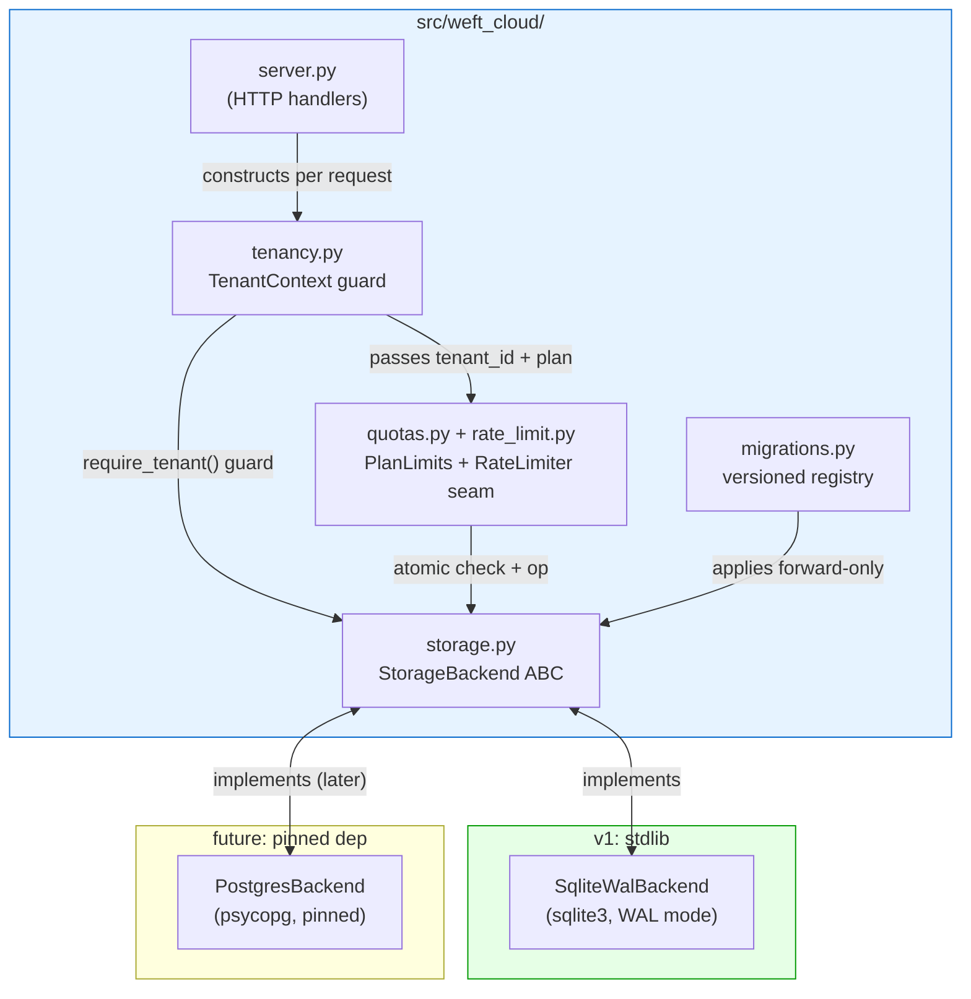
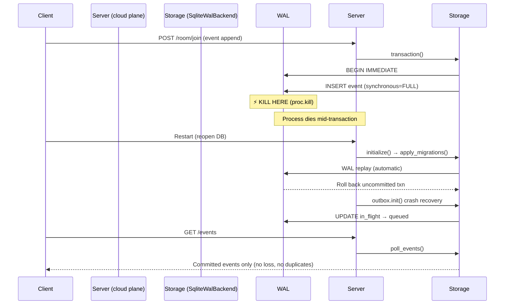

# Wave F — Cloud Spine Design

**Status:** Authoritative spec for the `src/weft_cloud/` plane.
**Source of truth:** `docs/PRODUCT_ROADMAP.md` §1 (settled 2026-08-05), §4 (ship gate).
**Scope:** The hosted-service plane that wraps the coordinator as a multi-tenant SaaS.
**Hard boundary:** `src/weft_mcp/` stays stdlib-only, forever. This plane may take pinned
dependencies but **v1 aims for zero new runtime deps** (stdlib SQLite-WAL).

---

## 1. Plane Boundary

### 1.1 What lives where

| Package | Role | Dependencies |
| --- | --- | --- |
| `src/weft_mcp/` | The **coordinator**: protocol engine, task lifecycle, rooms, roster, outbox, tenancy primitives. Pure stdlib. | none, ever |
| `src/weft_cloud/` | The **cloud spine**: hosted-service plane. Wraps the coordinator's data as a multi-tenant HTTP service. Owns tenant bindings, quotas, rate limits, cloud event mirror, migrations, and the storage interface. | stdlib for v1 (SQLite). Pinned deps only if/when Postgres lands. |

The coordinator is the engine; the cloud plane is the product that sits on top. The cloud plane
**never** re-implements coordinator logic — it composes the coordinator's MCP tools (via the
in-process client or direct store calls where the store is shared) and adds the hosted-service
concerns: tenancy at the storage boundary, plan-driven quotas, rate limiting, and a migration
path that adopts an existing coordinator database.

### 1.2 Package layout

```
src/weft_cloud/
  __init__.py          # package marker
  storage.py           # StorageBackend ABC + SqliteWalBackend (THE interface)
  tenancy.py           # TenantContext guard + storage-boundary tenancy enforcement
  migrations.py        # versioned migration registry (cloud_001..cloud_014), v3→cloud path
  quotas.py            # PlanLimits, per-tenant/per-room counters, enforcement seam
  rate_limit.py        # RateLimiter seam (token-bucket / window), per tenant+room
  service.py           # WeftCloudService: the /v1 REST handlers + _CloudHTTPHandler
  mcp.py               # hosted MCP endpoint (POST /mcp, Streamable HTTP + SSE)
  delivery_worker.py   # cloud_outbox delivery worker (claim/deliver/retry/DLQ)
  identity/            # Wave G: accounts, sessions, orgs, invites, agent_keys, tokens, context, mailer, outbox_worker
```

> **Naming delta from the original design (recorded honestly):** the Wave F
> sketch named the HTTP module `server.py` and a `config.py` for "plan
> resolution, dependency wiring". The implementation is `service.py` (handlers
> + `runtime_config()`, which owns plan/dependency wiring — argv → env →
> defaults) and `mcp.py` (hosted MCP). There is no `config.py`. The v1
> HTTP surface is stdlib `http.server` (`_CloudHTTPHandler` in `service.py`),
> honouring the zero-dep aim; a FastAPI swap is still allowed in a later wave
> but must be pinned and justified.

### 1.3 Dependency justification

| Dependency | Status | Justification |
| --- | --- | --- |
| `sqlite3` | stdlib | WAL backend for v1 |
| Everything else | none | Zero new runtime deps for v1 |

> **Rule:** Any dependency added to `src/weft_cloud/` must be (a) justified in one line,
> (b) pinned to an exact version, and (c) isolated to the cloud plane — never re-exported
> into `src/weft_mcp/`.

---

## 2. Storage Interface

The storage interface is the seam that makes the storage engine swappable. Business logic (server
handlers, quota enforcement, migration orchestration) imports **only** the interface — never
`sqlite3` directly.

### 2.1 The ABC

```python
# src/weft_cloud/storage.py

from abc import ABC, abstractmethod
from contextlib import contextmanager
from typing import Any, Iterator

class StorageTransaction(ABC):
    """A scoped unit of work. Backed by BEGIN IMMEDIATE (SQLite) or
    a Postgres transaction. Multi-step operations (join + cap check + event
    append) run inside one of these and commit atomically."""

    @abstractmethod
    def execute(self, sql: str, params: tuple = ()) -> "StorageCursor": ...

    @abstractmethod
    def commit(self) -> None: ...

    @abstractmethod
    def rollback(self) -> None: ...


class StorageBackend(ABC):
    """Transport-engine-agnostic persistence interface.

    Every method that reads or writes tenant-owned data takes tenant_id as a
    REQUIRED parameter (no default). This is structural tenancy — see §3."""

    # --- lifecycle ---
    @abstractmethod
    def initialize(self) -> None:
        """Idempotent schema setup. Creates cloud-plane tables only; does not
        touch coordinator tables (agent_credentials, tasks, sessions, room_*, ...)."""

    @abstractmethod
    @contextmanager
    def transaction(self) -> Iterator[StorageTransaction]:
        """Yield a scoped transaction. Caller commits or rolls back."""

    # --- tenant bindings (cloud-plane owned) ---
    @abstractmethod
    def create_tenant(self, tenant_id: str, name: str) -> None: ...

    @abstractmethod
    def get_tenant(self, tenant_id: str) -> dict[str, Any] | None: ...

    # --- rooms (cloud-plane hosted-state view over coordinator rooms) ---
    @abstractmethod
    def bind_room(self, tenant_id: str, room_id: str, coordinator_db_path: str) -> None:
        """Bind a coordinator room to a tenant. The coordinator owns room_* tables;
        the cloud plane records the binding + quotas."""

    @abstractmethod
    def list_rooms(self, tenant_id: str) -> list[dict[str, Any]]: ...

    # --- events / cursors (cloud event mirror) ---
    @abstractmethod
    def mirror_event(self, tenant_id: str, room_id: str, event_blob: dict) -> None:
        """Append-only mirror of coordinator events for the hosted replay surface."""

    @abstractmethod
    def poll_events(self, tenant_id: str, room_id: str, after_seq: int, limit: int) -> list[dict]: ...

    # --- quotas / counters ---
    @abstractmethod
    def increment_counter(self, tenant_id: str, counter: str, amount: int = 1) -> int:
        """Atomic increment. Returns new value. Used for rooms/members/events counters."""

    @abstractmethod
    def get_counter(self, tenant_id: str, counter: str) -> int: ...

    @abstractmethod
    def increment_room_counter(self, tenant_id: str, room_id: str, counter: str, amount: int = 1) -> int: ...

    @abstractmethod
    def get_room_counter(self, tenant_id: str, room_id: str, counter: str) -> int: ...

    # --- rate-limit counters ---
    @abstractmethod
    def check_rate_limit(self, tenant_id: str, room_id: str | None, limit_key: str,
                         max_allowed: int, window_seconds: int) -> tuple[bool, int]:
        """Returns (allowed, remaining). Implementation is engine-specific
        (SQLite: counter rows with windowed DELETE; Postgres: may use different)."""

    # --- outbox (cloud delivery mirror) ---
    @abstractmethod
    def enqueue_outbox(self, tenant_id: str, envelope_id: str, recipient: str, payload: str) -> str: ...

    @abstractmethod
    def claim_due_outbox(self, tenant_id: str, limit: int) -> list[dict]: ...

    # --- audit (cloud-plane audit, separate from coordinator events) ---
    @abstractmethod
    def append_audit(self, tenant_id: str, action: str, actor: str, object_id: str, payload: str) -> None: ...

    @abstractmethod
    def list_audit(self, tenant_id: str, limit: int = 100) -> list[dict]: ...

    # --- migrations ---
    @abstractmethod
    def get_schema_version(self) -> int: ...

    @abstractmethod
    def apply_migration(self, migration_id: str, up_sql: str) -> None: ...
```

> **The canonical interface lives in `src/weft_cloud/storage.py`.** The sketch
> above was the Wave-F proposal; the shipped ABC has grown beyond it. Extra
> methods implemented in production but not in this sketch: `executescript`
> (StorageTransaction), `enqueue_outbox_in_tx`, `mark_outbox_delivered`,
> `mark_outbox_retry`, `mark_outbox_dead` (the hosted delivery lifecycle), and
> `claim_due_outbox` gained a keyword-only cursor parameter. See §10 for the
> authoritative count.

### 2.2 Connection / transaction semantics

- **SQLite-WAL (`SqliteWalBackend`):** Each `transaction()` opens a connection, runs
  `BEGIN IMMEDIATE` (writer lock), yields a `StorageTransaction` wrapper, then commits or
  rolls back. Reads outside a transaction use `PRAGMA query_only = ON`.
- **Postgres (future `PostgresBackend`):** `transaction()` yields a `psycopg` connection
  in a `BEGIN` block. The interface is identical; only the implementation changes.
- **Atomicity guarantee:** A handler that needs to check a quota AND perform the operation
  (e.g., room join: check member cap + insert member + append event) opens ONE transaction,
  does all steps, commits. No partial state on crash.

### 2.3 Conformance-test strategy

ONE test suite, `tests/test_storage_interface.py`, runs against the `StorageBackend` ABC only:

```python
class StorageConformanceTests(unittest.TestCase):
    """Run against ANY backend. The same tests pass for SqliteWalBackend
    and (later) PostgresBackend unchanged."""

    def setUp(self):
        self.backend = self.make_backend()  # parametrized fixture

    def test_tenant_isolation(self): ...
    def test_transaction_rollback(self): ...
    def test_counter_atomicity(self): ...
    def test_rate_limit_window(self): ...
    def test_audit_append_and_read(self): ...
    def test_migration_idempotency(self): ...
```

The orchestrator adds a second backend by implementing the interface — the conformance suite
proves it without change.

### 2.4 Tenant scoping

Every interface method that touches tenant data **requires `tenant_id` as a positional
parameter** (no default value). The backend prefixes every query with `WHERE tenant_id = ?`.
There is no method that reads across tenants. See §3 for the structural guarantee.

---

## 3. Tenancy at the Storage Boundary

> **This is the riskiest section.** The requirement: tenant B provably cannot read, list,
> address, or enumerate anything belonging to tenant A — across rooms, tasks, events, roster,
> and audit.

### 3.1 Structural tenancy — not a convention

The danger: a caller that forgets to pass a tenant. The defense is **structural**:

1. **Every interface method that reads or writes tenant-owned data takes `tenant_id` as a
   required positional parameter** — no default, no `None` fallback. A call that omits it
   raises `TypeError` at the call site, not a silent cross-tenant read.

2. **The backend scopes every SQL by `tenant_id`:** `WHERE tenant_id = ?` is the first
   predicate on every query. There is no "global" read that spans tenants.

3. **A `TenantContext` guard** is constructed once per authenticated request and passed
   down through the call chain. It carries `tenant_id`, `actor_id`, `plan`, and the resolved
   `StorageBackend` reference. Handlers do not construct queries directly — they call
   storage methods through the context.

```python
@dataclass(frozen=True)
class TenantContext:
    tenant_id: str           # required, validated at construction
    actor_id: str            # authenticated actor
    plan: PlanLimits         # resolved plan for this tenant
    backend: StorageBackend  # the storage interface

    def require_tenant(self, requested_tenant_id: str) -> None:
        """Guard: a handler may ONLY act within its own tenant."""
        if requested_tenant_id != self.tenant_id:
            raise TenantIsolationError("cross-tenant access denied")
```

**Why a caller that "forgets" the tenant cannot leak:** The interface requires `tenant_id`
in the method signature (no default). If a handler calls `backend.list_rooms(tenant_id=...)`,
the only way to read another tenant's data is to **explicitly name the wrong tenant_id** —
and the `TenantContext.require_tenant()` guard rejects that before the call reaches the
backend. There is no code path where a missing tenant produces a cross-tenant read: a missing
`tenant_id` raises `TypeError`, and a wrong one is rejected by the guard.

### 3.2 Wiring `tenancy.py` at the boundary

The coordinator's `tenancy.py` provides:
- `create_org`, `add_member`, `is_member`, `derive_actor_key`, `assert_scope`

**Division of responsibility:**

| Layer | Responsibility |
| --- | --- |
| **Storage layer** (`storage.py`) | Enforces tenant isolation on the **data**: every query is scoped by `tenant_id`. Tenant B's queries cannot address tenant A's rows because the SQL literally cannot express it. |
| **Tenancy layer** (`tenancy.py` + cloud `tenancy.py`) | Enforces **who may act as a given agent** within a tenant: `assert_scope(db, org_id, agent_id, actor_key)` validates membership + key. The cloud plane calls this at the request boundary before constructing the `TenantContext`. |

The cloud plane's `TenantContext` construction:
1. Authenticate the request (OIDC in Wave G; bootstrap token for v1).
2. Resolve `(tenant_id, actor_id)` from the token.
3. Call `tenancy.assert_scope(db, tenant_id, actor_id, actor_key)` — raises `ScopeError`
   on mismatch.
4. Construct `TenantContext(tenant_id, actor_id, plan, backend)`.
5. Pass context to handler. Handler calls `context.require_tenant(requested_id)` before
   any storage operation.

### 3.3 Cross-tenant negative probes (the deliverable)

| Probe | Call | Expected result |
| --- | --- | --- |
| Room read cross-tenant | `backend.list_rooms(tenant_b_id)` by actor in tenant A | `TenantIsolationError` (guard rejects before backend) |
| Task read cross-tenant | `backend.poll_events(tenant_b_id, room_id, ...)` | `TenantIsolationError` |
| Event poll cross-tenant | `backend.poll_events(tenant_a_id, room_b_id, ...)` | `TenantIsolationError` |
| Roster list cross-tenant | `backend.list_rooms(tenant_b_id)` returns only tenant B's rooms | Returns `[]` for tenant A's rooms (backend scoped) |
| Audit read cross-tenant | `backend.list_audit(tenant_b_id)` by tenant A actor | `TenantIsolationError` |
| Counter cross-tenant | `backend.get_counter(tenant_b_id, "rooms")` | `TenantIsolationError` |
| Outbox cross-tenant | `backend.claim_due_outbox(tenant_b_id)` | `TenantIsolationError` |

**Invariant:** In every case, the `TenantContext.require_tenant()` guard fires before the
backend call. Even if the guard were bypassed, the backend's `WHERE tenant_id = ?` would
return only the named tenant's data — which is the wrong tenant, so the caller sees nothing
it didn't already know the ID of. Enumeration is impossible: there is no `list_all_tenants`
method on the storage interface.

---

## 4. Migrations

### 4.1 Versioned migration registry

```python
# src/weft_cloud/migrations.py

@dataclass
class Migration:
    migration_id: str   # e.g. "cloud_001_init"
    name: str
    up_sql: str         # forward-only

MIGRATIONS: list[Migration] = [
    Migration("cloud_001_init", "cloud plane bootstrap", CLOUD_INIT_SQL),
    Migration("cloud_002_identity_accounts", "identity accounts", ACCOUNTS_SQL),
    # ... (canonical registry lives in src/weft_cloud/migrations.py —
    # currently cloud_001_init through cloud_014_room_receipts_status_rename)
]

def apply_migrations(backend: StorageBackend) -> None:
    """Forward-only, idempotent. Tracks applied migrations in schema_migrations table."""
    current = backend.get_schema_version()
    for mig in MIGRATIONS[current:]:
        with backend.transaction() as tx:
            tx.execute(mig.up_sql)
            tx.execute("INSERT INTO schema_migrations(migration_id, applied_at) VALUES (?, ?)",
                      (mig.migration_id, utc_now()))
            tx.commit()
```

- **Forward-only:** Each migration has an `up_sql`. No `down_sql`.
- **Idempotent:** Every `CREATE TABLE` uses `IF NOT EXISTS`. Every `INSERT` uses
  `ON CONFLICT DO NOTHING`. Re-running a migration is a no-op.
- **Tracked:** `schema_migrations(migration_id TEXT PRIMARY KEY, applied_at TEXT NOT NULL)`
  records what has run. `get_schema_version()` returns `SELECT COUNT(*) FROM schema_migrations`.
- **Ordered:** Migrations are a list, applied in index order. No gaps, no out-of-order.
- **Ids are immutable.** `migration_id` is the ledger's primary key and is never
  mutated once recorded; a repair to an already-applied migration ships as a new
  forward migration under a fresh id (e.g. `cloud_014_room_receipts_status_rename`
  repairs interim `cloud_013` tables rather than editing `cloud_013`).

### 4.2 The v3→cloud upgrade path

The hosted service adopts a design-partner's existing `.weft/state.db` (schema v3).
The cloud migration **adds** cloud-plane tables; it does **not** alter any coordinator table.

**Cloud-plane tables (additive):**

```sql
CREATE TABLE IF NOT EXISTS cloud_tenants (
    tenant_id TEXT PRIMARY KEY,
    name TEXT NOT NULL,
    created_at TEXT NOT NULL,
    plan_id TEXT NOT NULL DEFAULT 'free'
);
CREATE TABLE IF NOT EXISTS cloud_tenant_rooms (
    tenant_id TEXT NOT NULL,
    room_id TEXT NOT NULL,
    coordinator_db_path TEXT NOT NULL,
    created_at TEXT NOT NULL,
    PRIMARY KEY (tenant_id, room_id)
);
CREATE TABLE IF NOT EXISTS cloud_counters (
    tenant_id TEXT NOT NULL,
    counter TEXT NOT NULL,
    value INTEGER NOT NULL DEFAULT 0,
    updated_at TEXT NOT NULL,
    PRIMARY KEY (tenant_id, counter)
);
CREATE TABLE IF NOT EXISTS cloud_room_counters (
    tenant_id TEXT NOT NULL,
    room_id TEXT NOT NULL,
    counter TEXT NOT NULL,
    value INTEGER NOT NULL DEFAULT 0,
    updated_at TEXT NOT NULL,
    PRIMARY KEY (tenant_id, room_id, counter)
);
CREATE TABLE IF NOT EXISTS cloud_rate_windows (
    tenant_id TEXT NOT NULL,
    room_id TEXT,
    limit_key TEXT NOT NULL,
    window_start REAL NOT NULL,
    count INTEGER NOT NULL DEFAULT 0,
    PRIMARY KEY (tenant_id, room_id, limit_key, window_start)
);
CREATE TABLE IF NOT EXISTS cloud_outbox (
    entry_id TEXT PRIMARY KEY,
    tenant_id TEXT NOT NULL,
    envelope_id TEXT NOT NULL,
    recipient TEXT NOT NULL,
    payload_json TEXT NOT NULL,
    status TEXT NOT NULL DEFAULT 'queued'
        CHECK(status IN ('queued','claimed','delivered','dead')),
    attempts INTEGER NOT NULL DEFAULT 0,
    next_attempt_at REAL NOT NULL DEFAULT 0,
    claimed_at REAL,
    claimed_by TEXT,
    last_error TEXT,
    dispatched_at REAL,
    created_at TEXT NOT NULL,
    updated_at TEXT NOT NULL
);
CREATE TABLE IF NOT EXISTS cloud_audit (
    audit_id TEXT PRIMARY KEY,
    tenant_id TEXT NOT NULL,
    action TEXT NOT NULL,
    actor TEXT NOT NULL,
    object_id TEXT,
    payload_json TEXT NOT NULL,
    created_at TEXT NOT NULL
);
CREATE TABLE IF NOT EXISTS cloud_event_mirror (
    mirror_id TEXT PRIMARY KEY,
    tenant_id TEXT NOT NULL,
    room_id TEXT NOT NULL,
    seq INTEGER NOT NULL,
    event_json TEXT NOT NULL,
    created_at TEXT NOT NULL
);
CREATE TABLE IF NOT EXISTS schema_migrations (
    migration_id TEXT PRIMARY KEY,
    applied_at TEXT NOT NULL
);
```

**Critical:** The `agent_credentials` table is NOT touched. Existing actor tokens remain valid.
No credentials are fabricated. The migration is purely additive.

### 4.3 Rollback story

- **Down-migrations are NOT provided.** They are data-destructive and untestable.
- **Rollback = restore from backup.** The documented procedure:
  1. `cp state.db state.db.pre-cloud-backup` (pre-upgrade backup step).
  2. Run `apply_migrations(backend)`.
  3. If anything fails: restore `state.db.pre-cloud-backup`.
- **The backup IS the rollback.** No `down_sql`, no partial-rollback logic.

### 4.4 The upgrade test (real, not simulated)

1. Open a real schema-v3 database (not a fresh one).
2. Exercise v3: register agents, create tasks, emit session events via the coordinator.
3. Snapshot the file: `cp state.db state.db.v3-snapshot`.
4. Run `apply_migrations(backend)`.
5. Assert:
   - `agent_credentials` table unchanged (same row count, same token hashes).
   - Existing actor tokens still authenticate against `agent_credentials.token_hash`.
   - All `tasks`, `sessions`, `session_events` rows present and unchanged.
   - New cloud tables exist and are empty (no fabricated data).
   - `SELECT COUNT(*) FROM schema_migrations` equals the number of applied migrations.

---

## 5. Quotas + Rate Limits

### 5.1 Quota model

A **plan** is a dict of limits, resolved per tenant:

```python
@dataclass(frozen=True)
class PlanLimits:
    max_rooms: int = 5
    max_members_per_room: int = 15
    max_events_per_month: int = 10_000
    max_messages_per_minute: int = 60
    # Wave I adds: billing_tier, stripe_price_id, etc.

PLANS: dict[str, PlanLimits] = {
    "free": PlanLimits(),
    "pro": PlanLimits(max_rooms=50, max_members_per_room=50, max_events_per_month=100_000),
}
```

**Counters persisted in `cloud_counters` and `cloud_room_counters`.**

### 5.2 Enforcement (atomic with the operation)

```python
def join_room_with_quota(ctx: TenantContext, room_id: str, ...) -> dict:
    with ctx.backend.transaction() as tx:
        # 1. Check per-room member cap (quota)
        current = tx.get_room_counter(ctx.tenant_id, room_id, "members")
        if current >= ctx.plan.max_members_per_room:
            raise QuotaError("quota_exceeded", "room member limit reached")
        # 2. Check per-tenant room count (if new room)
        # ... (same pattern)
        # 3. Perform the join (delegate to coordinator)
        # 4. Increment counter
        tx.increment_room_counter(ctx.tenant_id, room_id, "members")
        tx.commit()
```

The quota check and the state mutation happen in the **same transaction**. No race, no
partial state.

### 5.3 Rate-limiter seam

```python
class RateLimiter(ABC):
    @abstractmethod
    def check(self, backend: StorageBackend, tenant_id: str, room_id: str | None,
              key: str, max_allowed: int, window_seconds: int) -> RateResult: ...

@dataclass
class RateResult:
    allowed: bool
    remaining: int
    retry_after: float | None  # None if allowed
```

**v1 implementation:** `SqliteRateLimiter` uses `cloud_rate_windows` rows with windowed
cleanup. **Wave I** swaps in a Redis-backed limiter without touching enforcement code.

**Auth endpoints reuse this seam.** `enforce_auth_rate_limit` (rate_limit.py) maps the
public signup / signin / reset-request actions onto the same `RateLimiter`, keyed on the
client IP and the normalized email. The email tier is counted regardless of whether the
account exists, so a throttled known and a throttled unknown address return a
byte-identical 429 — the refusal cannot enumerate accounts — and the limiter runs before
any existence-dependent branch, preserving the signin timing equalisation. Limits are
per-instance overridable (`auth_rate_limits`) over the defaults in
`DEFAULT_AUTH_RATE_LIMITS`.

### 5.4 Error codes

| Code | Meaning |
| --- | --- |
| `quota_exceeded` | Tenant or room has hit a plan limit. Operation refused. |
| `rate_limited` | Too many requests in the window. Response includes `Retry-After`. |

---

## 6. Durability Under Crash

### 6.1 WAL semantics

- **Coordinator default:** `PRAGMA synchronous = NORMAL` (current `core.py`, `room.py`,
  `outbox.py`).
- **Cloud plane ack path:** Use `synchronous = FULL` for the **acknowledged-event path**
  (the `mirror_event` + `enqueue_outbox` operations that the client observes). Rationale:
  `NORMAL` is safe for WAL mode under OS crash but not under power loss; `FULL` guarantees
  the ack is durable at the cost of throughput. The cloud plane is the product boundary —
  durability matters more than throughput at v1 scale (single instance, design-partner load).
- **Non-acknowledged reads and counter increments:** `synchronous = NORMAL` is acceptable.

### 6.2 The kill test (real, not simulated)

**Driver process:**

1. Spawn the coordinator as a subprocess (`subprocess.Popen` with stdio pipes).
2. Perform writes: room join + event append + outbox enqueue. Capture the event IDs
   the client observed.
3. **Kill the process mid-write:** `proc.terminate()` (SIGTERM) or `proc.kill()` (SIGKILL)
   — NOT an exception, NOT a graceful shutdown. The kill must land **mid-transaction**.
4. **Deterministic mid-write hook:** Add a test-only `PRAGMA wal_sync_hook` or a
   large-enough batch (e.g., 10,000 event appends in one transaction) so the kill lands
   while `COMMIT` is in flight.
5. Restart the process (reopen the database).
6. Assert:
   - **No torn state:** `PRAGMA integrity_check` returns `ok`. Schema intact.
   - **No lost acknowledged events:** Every event the client observed (and that was
     committed) is present. Events not yet acknowledged by the client are absent
     (correct — they were never committed).
   - **Outbox resumes:** `claim_due_outbox` returns the queued entries. No `in_flight`
     entries remain stranded (outbox crash recovery resets them on `init()`).
   - **Cursors coherent:** Per-member cursors point to the last acked event.

### 6.3 Recovery: automatic vs. app-driven

| Recovery | Mechanism |
| --- | --- |
| WAL replay (torn-page, mid-write rollback) | **Automatic** — SQLite WAL replays on open. |
| Schema migration on startup | **App-driven** — `apply_migrations(backend)` runs in `_initialize()`, idempotent. |
| Outbox crash recovery | **App-driven** — `outbox.init()` resets `in_flight → queued` (already exists in `outbox.py:112-119`). The cloud plane's `cloud_outbox` table has the same reset logic in `migrations.py` startup. |

---

## 7. Conformance + Negative-Case Spec

These are the **deliverable tests**. Each specifies: the call, the expected result/error,
the invariant it protects.

### 7.1 Interface conformance suite (`tests/test_storage_interface.py`)

| Test | Call | Expected | Invariant |
| --- | --- | --- | --- |
| `test_tenant_scoping` | `backend.list_rooms("tenant_a")` after inserting rooms for tenant_a and tenant_b | Returns only tenant_a's rooms | Tenant isolation at storage boundary |
| `test_transaction_rollback` | Insert a room, raise before commit, re-read | Room absent | Atomicity |
| `test_counter_atomicity` | Two threads increment same counter 100× each | Final value = 200 | No lost updates under concurrency |
| `test_rate_limit_window` | Call `check_rate_limit` 70× with limit=60 in window | First 60 allowed, next 10 refused | Rate limit fires correctly |
| `test_audit_append_read` | `append_audit` then `list_audit` | Entry present with correct action/actor | Audit trail durable |
| `test_migration_idempotency` | Run `apply_migrations` twice | Second run is no-op; version unchanged | Idempotent migrations |
| `test_outbox_enqueue_claim` | `enqueue_outbox` then `claim_due_outbox` | Entry claimable, status transitions | Outbox durability |

### 7.2 Tenancy negative suite (`tests/test_tenancy_negative.py`)

| Test | Call | Expected | Invariant |
| --- | --- | --- | --- |
| `test_cross_tenant_room_read` | Actor in tenant A calls `list_rooms(tenant_b_id)` | `TenantIsolationError` | Cross-tenant read refused |
| `test_cross_tenant_event_poll` | Actor in tenant A calls `poll_events(tenant_b_id, room_id, ...)` | `TenantIsolationError` | Cross-tenant event access refused |
| `test_cross_tenant_audit_read` | Actor in tenant A calls `list_audit(tenant_b_id)` | `TenantIsolationError` | Cross-tenant audit access refused |
| `test_cross_tenant_counter_read` | Actor in tenant A calls `get_counter(tenant_b_id, "rooms")` | `TenantIsolationError` | Cross-tenant counter access refused |
| `test_cross_tenant_outbox_claim` | Actor in tenant A calls `claim_due_outbox(tenant_b_id)` | `TenantIsolationError` | Cross-tenant outbox access refused |
| `test_missing_tenant_id_raises` | Call any storage method without `tenant_id` arg | `TypeError` (missing required arg) | Structural tenancy enforced at signature level |
| `test_guard_rejects_wrong_tenant` | `ctx.require_tenant("other_tenant")` | `TenantIsolationError` | Guard fires before backend call |

### 7.3 Migration upgrade test (`tests/test_migration_upgrade.py`)

| Test | Call | Expected | Invariant |
| --- | --- | --- | --- |
| `test_v3_to_cloud_upgrade` | Open real v3 DB, exercise coordinator, snapshot, apply cloud migration, reopen | `agent_credentials` unchanged, tokens still valid, all coordinator rows present, cloud tables exist empty | No data loss, no fabricated credentials |
| `test_migration_additive_only` | Apply migration, inspect schema | No coordinator table altered (same column set) | Migration is purely additive |
| `test_migration_idempotent` | Apply migration twice | Second run no-op, no duplicate rows | Idempotent |

### 7.4 Quota / rate-limit refusal tests (`tests/test_quotas.py`)

| Test | Call | Expected | Invariant |
| --- | --- | --- | --- |
| `test_room_member_cap` | Join members until cap, attempt one more | `quota_exceeded` | Room member limit enforced |
| `test_tenant_room_cap` | Create rooms until cap, attempt one more | `quota_exceeded` | Tenant room limit enforced |
| `test_rate_limit_exhaustion` | Exhaust rate limit in window | `rate_limited` with `Retry-After` | Rate limit fires |
| `test_atomic_quota_check` | Concurrent joins at cap boundary | Exactly `cap` members, no over-subscription | Quota check + mutation is atomic |

### 7.5 Crash-kill test (`tests/test_crash_durability.py`)

| Test | Call | Expected | Invariant |
| --- | --- | --- | --- |
| `test_kill_mid_write` | Spawn coordinator, perform writes, kill mid-transaction, restart | No torn state, no lost acknowledged events, outbox resumes, cursors coherent | Durability under crash |
| `test_outbox_crash_recovery` | Leave entries `in_flight`, restart | Entries reset to `queued`, claimable | Outbox crash recovery works |
| `test_wal_replay_after_kill` | Kill during large write batch, restart | `PRAGMA integrity_check = ok`, committed events present | WAL replay correct |

---

## 8. Diagrams

### 8.1 Cloud plane layering



### 8.2 Crash-recovery sequence



---

## 9. Risks (what the orchestrator must check before building)

1. **`TenantContext` construction is the single chokepoint.** If any handler bypasses the
   guard and calls the backend with a raw `tenant_id`, the structural guarantee breaks.
   The orchestrator must verify: every handler receives `ctx: TenantContext`, never a raw
   `tenant_id`.

2. **The `synchronous = FULL` choice for the ack path** has a throughput cost. At v1 scale
   (single instance, design-partner load) this is acceptable, but the orchestrator should
   measure: if the kill test passes but p95 latency regresses, revert the non-ack paths
   to `NORMAL`.

3. **Outbox crash recovery must run on every startup**, not just first init. The existing
   `outbox.py:112-119` does this; the cloud plane's `cloud_outbox` table needs the same
   logic. The orchestrator must not skip this.

4. **Migration idempotency is a product promise.** If a migration runs twice (e.g., process
   killed mid-migration), the second run must succeed. Every `CREATE` must be `IF NOT EXISTS`,
   every `INSERT` must be `ON CONFLICT DO NOTHING`. The orchestrator must audit every
   migration SQL for this.

5. **Cross-tenant tests must be real, not mocked.** The negative suite must use a real
   `SqliteWalBackend` with two real tenants. A mocked backend proves nothing.

6. **The `agent_credentials` table is sacrosanct.** The cloud migration must NOT touch it.
   The upgrade test asserts this explicitly. If any migration SQL references
   `agent_credentials`, reject it.

7. **Postgres backend (future) must pass the conformance suite unchanged.** The interface
   must be complete enough that a `PostgresBackend` can implement every method without
   adding new methods. The orchestrator should review: does any method embed SQLite-specific
   semantics (e.g., `PRAGMA`, `AUTOINCREMENT`) that would not translate?

---

## 10. Interface method count

The shipped `StorageBackend` ABC (counted from `src/weft_cloud/storage.py`
`@abstractmethod` decorators) exposes **26 abstract methods**:

StorageTransaction: `execute`, `commit`, `rollback`, `executescript` (4).

StorageBackend: `initialize`, `transaction`, `create_tenant`, `get_tenant`,
`bind_room`, `list_rooms`, `mirror_event`, `poll_events`, `increment_counter`,
`get_counter`, `increment_room_counter`, `get_room_counter`,
`check_rate_limit`, `enqueue_outbox`, `enqueue_outbox_in_tx`,
`claim_due_outbox`, `mark_outbox_delivered`, `mark_outbox_retry`,
`mark_outbox_dead`, `append_audit`, `list_audit`, `get_schema_version`,
`apply_migration` (22).

> The original Wave-F count below was 21/22 and is superseded — the outbox
> lifecycle methods (`mark_outbox_delivered` / `mark_outbox_retry` /
> `mark_outbox_dead`), `enqueue_outbox_in_tx` (atomic event+receipt writes in
> `rooms.py`), and `executescript` (idempotent schema bootstrap) were added
> after the design locked. This section is kept current against the code, not
> the proposal.

---

## 11. Reference map (actual code this design builds on)

| Design element | Existing primitive |
| --- | --- |
| Tenant isolation | `tenancy.py`: `assert_scope`, `is_member`, `derive_actor_key` |
| Room state | `room.py`: `RoomStore`, `room_*` tables, `join_room` (cap enforcement under `BEGIN IMMEDIATE`) |
| Schema versioning | `core.py`: `_initialize` → `schema_meta` table, `SCHEMA_VERSION = 3`, idempotent migration pattern |
| Outbox durability | `outbox.py`: `init()` crash recovery (`in_flight → queued`), `claim_dequeue`, `mark_delivered`, `mark_retry`, DLQ |
| Transaction pattern | `core.py:_transaction`, `room.py:_transaction`, `outbox.py:_txn` — all `BEGIN IMMEDIATE` with rollback on exception |
| Connection lifecycle | `core.py`: `_acquire_connection` / `_release_connection` pool, `close()` for Windows file-lock safety |
