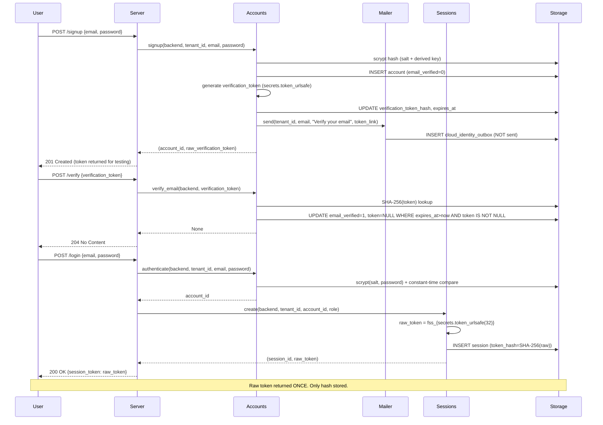
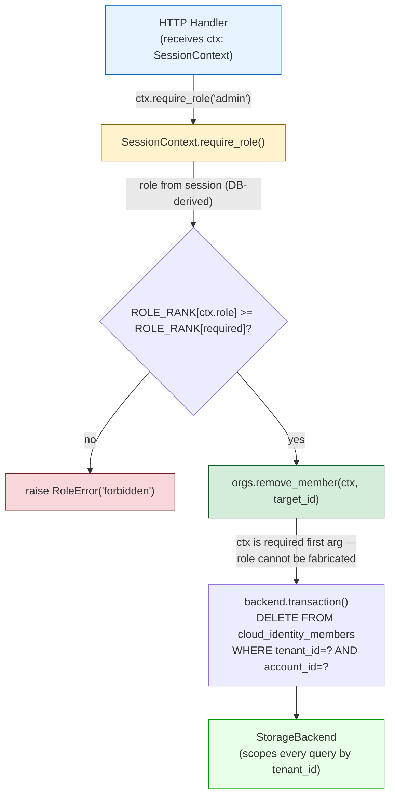
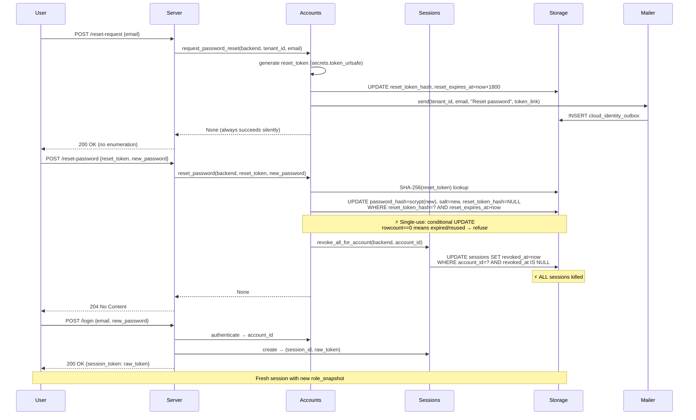

# Wave G — Identity Design

**Status:** Authoritative spec for identity in the `src/finalisma_cloud/` plane.
**Source of truth:** `docs/PRODUCT_ROADMAP.md` §4 (ship gate), §5 (Wave G — Identity).
**Scope:** Email + password auth, local sessions, orgs, membership, roles, invites — all behind the Wave F storage interface. Stage 1 (THIS WAVE): tokens generated properly but written to a local outbox (no external email). Stage 2 (later): real transactional email + OIDC behind a `Mailer` interface swap.
**Hard boundary:** `src/finalisma_mcp/` stays stdlib-only, untouched. No direct `sqlite3` in identity business logic — everything goes through `StorageBackend`.

---

## 1. Plane Boundary

All identity lives in `src/finalisma_cloud/`, behind the Wave F `StorageBackend` interface. The coordinator plane (`finalisma_mcp/`) is untouched and stays stdlib-only.

### 1.1 Proposed module layout

```
src/finalisma_cloud/
  identity/
    __init__.py        # package marker
    accounts.py        # AccountStore: signup, password hashing (scrypt), verification, reset
    sessions.py        # SessionStore: opaque session tokens, SHA-256 at rest, rotation, revocation
    orgs.py            # OrgStore: membership, roles, role-gated operations via SessionContext
    invites.py         # InviteStore: email-addressed, expiring, single-use invites
    tokens.py          # Token generation + hashing (secrets.token_urlsafe, SHA-256)
    context.py         # SessionContext (auth analog of TenantContext), require_role()
    mailer.py          # Mailer ABC + LocalOutboxMailer (Stage 1: writes to cloud_outbox, no send)
```

| Module | Ownership |
| --- | --- |
| `accounts.py` | Account lifecycle: create, password hash/verify, email verification, password reset. All tenant-scoped. |
| `sessions.py` | Session lifecycle: issue, validate, rotate, revoke, revoke-all. Token hygiene per `roster.py`. |
| `orgs.py` | Org/membership/role operations. Every gated method takes `SessionContext` as required first arg. |
| `invites.py` | Invite create/accept. Single-use, expiring, role-scoped, email-locked. |
| `tokens.py` | Opaque token generation (`secrets.token_urlsafe`) + SHA-256 hashing. Shared by sessions, verification, reset, invites. |
| `context.py` | `SessionContext` dataclass (analogous to `TenantContext`). `require_role()` guard. |
| `mailer.py` | `Mailer` ABC: `send(tenant_id, to_email, subject, body)`. `LocalOutboxMailer` for Stage 1. |

### 1.2 Dependency justification

| Dependency | Status | Justification |
| --- | --- | --- |
| `hashlib.scrypt` | stdlib | Password hashing (n=2^14, r=8, p=1, dklen=64 — 16 MiB, ~50ms) |
| `hashlib.sha256` | stdlib | Token digest at rest |
| `secrets.token_urlsafe` | stdlib | Opaque token generation (CSPRNG) |
| Everything else | none | Zero new runtime deps for Wave G |

### 1.3 What this design REQUIRES vs adds

| Concern | Action |
| --- | --- |
| `StorageBackend` interface | **No change required.** Identity uses existing methods (`create_tenant`, `get_tenant`, `transaction`, `execute`, `increment_counter`, `append_audit`) plus new `cloud_identity_*` tables accessed through `transaction().execute()`. |
| `tenancy.py` (`TenantContext`) | **No change required.** Identity adds a parallel `SessionContext` that wraps `TenantContext` — does not modify it. |
| `migrations.py` | **Requires extension.** New migration IDs `cloud_002` through `cloud_006` (identity tables) appended to the `MIGRATIONS` list. The existing `cloud_001_init` is untouched. |
| `storage.py` | **No change required.** The `StorageBackend` ABC already exposes `transaction()` yielding a `StorageTransaction` with `execute()`, `commit()`, `rollback()`. Identity modules use this to create/read rows in new tables — no new ABC methods needed. |
| `roster.py` / `outbox.py` (coordinator plane) | **Not touched.** Identity mirrors their token-hygiene and outbox patterns but lives entirely in the cloud plane. |

---

## 2. The Org ⟷ Tenant Mapping

**An org IS a Wave F tenant.** There is exactly one namespace for orgs/tenants; identity does not create a parallel org id.

### 2.1 The mapping

The identity module reuses the existing `tenant_id` scoping from Wave F:

- `backend.create_tenant(tenant_id, name, plan_id)` is the org creation point.
- Identity calls `create_tenant` (or assumes it exists) and then adds account/password/session/membership rows keyed by the **same `tenant_id`**.
- The `cloud_tenants` table (Wave F) holds the canonical tenant row. Identity tables reference it by `tenant_id` with `FOREIGN KEY(tenant_id) REFERENCES cloud_tenants(tenant_id)`.

### 2.2 Invariant: single namespace

> **Invariant:** There is exactly one org identifier — `tenant_id`. Identity never introduces an `org_id`, `organization_id`, or any second boundary. Every identity table is scoped by `tenant_id`, and every identity operation is tenant-scoped through the same structural tenancy that Wave F enforces.

### 2.3 Who creates the tenant row?

Two valid paths (the implementer chooses one; both are correct):

1. **Identity creates it:** `accounts.signup()` calls `backend.create_tenant(tenant_id, name, plan_id)` as the first step, then inserts the account + membership rows. This is the self-service signup path.
2. **Provisioning creates it:** An operator/billing flow calls `backend.create_tenant()` first, then identity adds accounts to the existing tenant. This is the enterprise/seed path.

In both cases, the `cloud_tenants` row exists before any identity row references it. The foreign key constraint enforces this.

### 2.4 New tables the identity migrations add

| Table | Migration ID | Purpose |
| --- | --- | --- |
| `cloud_identity_accounts` | `cloud_002_identity_accounts` | Account credentials + verification/reset state |
| `cloud_identity_sessions` | `cloud_003_identity_sessions` | Opaque session tokens (hashed) |
| `cloud_identity_members` | `cloud_004_identity_members` | Account↔tenant membership + role |
| `cloud_identity_invites` | `cloud_005_identity_invites` | Pending invitations |
| `cloud_identity_outbox` | `cloud_006_identity_outbox` | Local email outbox (Stage 1) |

These coexist with `cloud_tenants`, `cloud_counters`, `cloud_audit`, etc. They are purely additive — no existing table is altered.

---

## 3. Accounts

### 3.1 Password hashing

**Algorithm:** `hashlib.scrypt` (stdlib).

**Parameters:** `n=2**14, r=8, p=1, dklen=64`

**Justification:** 16 MiB memory, ~50ms on modern hardware — OWASP-recommended minimum for scrypt. The memory cost makes GPU/ASIC attacks expensive.

**Salt:** 32 random bytes per user (`os.urandom(32)`), stored alongside the hash.

**Storage:** Only `salt` (BLOB) + `password_hash` (BLOB) are stored. The raw password is NEVER stored, logged, or serialised.

### 3.2 Constant-time comparison

Password verification uses `hmac.compare_digest(stored_hash, computed_hash)` — never `==` on secrets.

### 3.3 Unknown-user timing invariance

To prevent user enumeration via timing, a lookup for a non-existent email performs the **same scrypt computation** against a dummy salt + dummy hash, then a constant-time compare that always fails. The response time is indistinguishable from a wrong-password case.

### 3.4 Schema

```sql
CREATE TABLE IF NOT EXISTS cloud_identity_accounts (
    account_id TEXT PRIMARY KEY,            -- acct_{uuid}
    tenant_id TEXT NOT NULL,                -- FK to cloud_tenants
    email TEXT NOT NULL,                    -- scoped to tenant (see uniqueness)
    salt BLOB NOT NULL,                     -- 32 random bytes
    password_hash BLOB NOT NULL,            -- scrypt output (64 bytes)
    created_at TEXT NOT NULL,               -- ISO-8601
    email_verified INTEGER NOT NULL DEFAULT 0,  -- 0/1 boolean
    verification_token_hash TEXT,           -- SHA-256 of the verify token (NULL when verified/expired)
    verification_expires_at REAL NOT NULL DEFAULT 0,  -- epoch seconds
    reset_token_hash TEXT,                  -- SHA-256 of the reset token (NULL when inactive)
    reset_expires_at REAL NOT NULL DEFAULT 0,   -- epoch seconds
    FOREIGN KEY(tenant_id) REFERENCES cloud_tenants(tenant_id)
);
CREATE INDEX IF NOT EXISTS idx_identity_accounts_tenant_email
    ON cloud_identity_accounts(tenant_id, email);
```

### 3.5 Email uniqueness

**Constraint:** Email is unique **per tenant**, not globally. Two different orgs can have the same email address (e.g., `alice@corp.com` in org A and org B are distinct accounts).

```sql
CREATE UNIQUE INDEX IF NOT EXISTS idx_identity_accounts_tenant_email_unique
    ON cloud_identity_accounts(tenant_id, email);
```

This means:
- `UNIQUE(tenant_id, email)` — one account per email within an org.
- No global `UNIQUE(email)` — the same email may exist across tenants.

### 3.6 Account lifecycle

| Operation | Method | Behavior |
| --- | --- | --- |
| Signup | `accounts.signup(backend, tenant_id, email, password) -> (account_id, verification_token)` | Creates account, generates verification token, enqueues verification email via `Mailer`. |
| Verify email | `accounts.verify_email(backend, verification_token) -> None` | Single-use, 24h expiry. Sets `email_verified=1`, clears token. |
| Authenticate | `accounts.authenticate(backend, tenant_id, email, password) -> account_id` | Returns account_id on success; raises `AuthError("invalid_credentials")` on failure. Timing-invariant for unknown emails. |
| Change password | `accounts.change_password(backend, account_id, old_password, new_password) -> None` | Verifies old, hashes new, revokes all sessions. |
| Request reset | `accounts.request_password_reset(backend, tenant_id, email) -> None` | Generates reset token, enqueues reset email. Always succeeds silently (no enumeration). |
| Reset password | `accounts.reset_password(backend, reset_token, new_password) -> None` | Single-use, 30-min expiry. Changes password AND revokes ALL sessions. |

---

## 4. Sessions

### 4.1 Token hygiene (mirror `roster.py`)

- Raw token: `fss_{secrets.token_urlsafe(32)}` (40 chars, URL-safe).
- Stored: `hashlib.sha256(raw_token.encode("utf-8")).hexdigest()` — SHA-256 hex digest.
- Raw token is returned **ONCE** (at creation) — never stored, never logged, never in a URL path, never in an error message or serialised response.
- Lookup: constant-time compare of `sha256(provided_token)` against stored `token_hash`.

### 4.2 Schema

```sql
CREATE TABLE IF NOT EXISTS cloud_identity_sessions (
    session_id TEXT PRIMARY KEY,            -- ses_{uuid}
    tenant_id TEXT NOT NULL,                -- FK to cloud_tenants
    account_id TEXT NOT NULL,               -- FK to cloud_identity_accounts
    token_hash TEXT NOT NULL UNIQUE,        -- SHA-256 of the raw session token
    created_at TEXT NOT NULL,
    expires_at REAL NOT NULL,               -- epoch seconds
    revoked_at REAL,                        -- NULL = active
    role_snapshot TEXT NOT NULL,            -- role at session creation (owner/admin/member)
    FOREIGN KEY(tenant_id) REFERENCES cloud_tenants(tenant_id),
    FOREIGN KEY(account_id) REFERENCES cloud_identity_accounts(account_id)
);
CREATE INDEX IF NOT EXISTS idx_identity_sessions_account
    ON cloud_identity_sessions(account_id, revoked_at);
CREATE INDEX IF NOT EXISTS idx_identity_sessions_token
    ON cloud_identity_sessions(token_hash);
```

### 4.3 Session lifecycle

| Operation | Method | Behavior |
| --- | --- | --- |
| Create | `sessions.create(backend, tenant_id, account_id, role, ttl_seconds=86400) -> (session_id, raw_token)` | Issues session. Raw token returned once. |
| Validate | `sessions.validate(backend, raw_token) -> SessionContext` | Looks up by hash, checks expiry + revocation. Returns `SessionContext` or raises `AuthError("invalid_session")`. |
| Revoke | `sessions.revoke(backend, session_id) -> None` | Sets `revoked_at`. |
| Revoke-all | `sessions.revoke_all_for_account(backend, account_id) -> None` | Sets `revoked_at` on ALL sessions for the account. Used by password change/reset. |
| Revoke-all-for-tenant | `sessions.revoke_all_for_tenant(backend, tenant_id) -> None` | Nuclear option: revokes every session in a tenant. |

### 4.4 Rotation on privilege change

**Policy: revoke-all + re-issue.** When an account's role changes (e.g., member → admin), ALL existing sessions for that account are revoked. The next request fails validation, forcing re-authentication, which creates a new session with the updated `role_snapshot`.

**Why revoke (not update in place):** Sessions carry a `role_snapshot` captured at creation. Updating it in place would require either mutating sessions (fragile, race-prone) or re-validating role on every request (defeats the purpose of the snapshot). Revoke-all is simple, deterministic, and the re-auth cost is negligible (one login).

### 4.5 Constant-time session lookup

```python
token_hash = hashlib.sha256(raw_token.encode("utf-8")).hexdigest()
# Lookup by indexed token_hash column — the DB does the scan, not a Python == loop.
row = tx.execute("SELECT * FROM cloud_identity_sessions WHERE token_hash = ?", (token_hash,)).fetchone()
```

---

## 5. Email Verification + Password Reset

### 5.1 The `Mailer` interface

```python
# src/finalisma_cloud/identity/mailer.py

from abc import ABC, abstractmethod

class Mailer(ABC):
    """Pluggable mailer. Stage 1: LocalOutboxMailer (no send).
    Stage 2: TransactionalEmailMailer (e.g., Postmark, SES) behind the same interface."""

    @abstractmethod
    def send(self, tenant_id: str, to_email: str, subject: str, body: str) -> None:
        ...


class LocalOutboxMailer(Mailer):
    """Stage 1 mailer: writes the email to cloud_identity_outbox instead of sending.
    The outbox row contains the full email (to, subject, body). A future worker
    (Stage 2) drains the same outbox via the real provider."""

    def __init__(self, backend: StorageBackend):
        self.backend = backend

    def send(self, tenant_id: str, to_email: str, subject: str, body: str) -> None:
        entry_id = _new_id("idem")
        now_iso = utc_now_iso()
        with self.backend.transaction() as tx:
            tx.execute(
                "INSERT INTO cloud_identity_outbox(entry_id, tenant_id, to_email, subject, body, created_at) "
                "VALUES (?, ?, ?, ?, ?, ?)",
                (entry_id, tenant_id, to_email, subject, body, now_iso),
            )
            tx.commit()
```

### 5.2 Token lifecycles

#### Verification token

| Attribute | Value |
| --- | --- |
| Purpose | Confirm email ownership after signup |
| Generated | On signup (`accounts.signup`) |
| Raw format | `fvt_{secrets.token_urlsafe(32)}` |
| Stored | `sha256(raw)` in `verification_token_hash` |
| Expiry | 24 hours |
| Single-use | Consumed atomically: `UPDATE ... SET email_verified=1, verification_token_hash=NULL WHERE verification_token_hash=? AND verification_expires_at > ? AND email_verified=0` |
| On accept | Sets `email_verified=1`, clears `verification_token_hash` |

#### Reset token

| Attribute | Value |
| --- | --- |
| Purpose | Allow password reset after forgetting |
| Generated | On reset request (`accounts.request_password_reset`) |
| Raw format | `frt_{secrets.token_urlsafe(32)}` |
| Stored | `sha256(raw)` in `reset_token_hash` |
| Expiry | 30 minutes |
| Single-use | Consumed atomically: `UPDATE ... SET password_hash=?, salt=?, reset_token_hash=NULL WHERE reset_token_hash=? AND reset_expires_at > ? AND reset_token_hash IS NOT NULL` |
| On accept | Changes password AND revokes ALL sessions (the "reset kills sessions" invariant) |

### 5.3 Atomic single-use enforcement

Both tokens are consumed with a **conditional UPDATE** inside a transaction:

```python
# Pseudocode for reset consumption:
with backend.transaction() as tx:
    # 1. Look up the account by token hash.
    row = tx.execute(
        "SELECT account_id FROM cloud_identity_accounts WHERE reset_token_hash = ?",
        (token_hash,),
    ).fetchone()
    if row is None:
        raise AuthError("invalid_token")
    # 2. Consume atomically: only succeeds if token is unexpired and not yet consumed.
    result = tx.execute(
        "UPDATE cloud_identity_accounts SET password_hash=?, salt=?, reset_token_hash=NULL, reset_expires_at=0 "
        "WHERE account_id=? AND reset_token_hash=? AND reset_expires_at > ?",
        (new_hash, new_salt, row["account_id"], token_hash, now_epoch()),
    )
    if result.rowcount == 0:
        raise AuthError("invalid_token")  # expired or already consumed
    # 3. Revoke all sessions.
    tx.execute(
        "UPDATE cloud_identity_sessions SET revoked_at=? WHERE account_id=? AND revoked_at IS NULL",
        (now_epoch(), row["account_id"]),
    )
    tx.commit()
```

The `rowcount == 0` check is the single-use guard: a second call with the same token finds `reset_token_hash IS NULL` (already cleared) and the `WHERE` clause fails.

### 5.4 Local outbox schema

```sql
CREATE TABLE IF NOT EXISTS cloud_identity_outbox (
    entry_id TEXT PRIMARY KEY,              -- idem_{uuid}
    tenant_id TEXT NOT NULL,
    to_email TEXT NOT NULL,
    subject TEXT NOT NULL,
    body TEXT NOT NULL,
    created_at TEXT NOT NULL,
    dispatched_at REAL,                     -- NULL = pending (Stage 2 fills this)
    FOREIGN KEY(tenant_id) REFERENCES cloud_tenants(tenant_id)
);
```

---

## 6. Orgs, Membership, Roles

### 6.1 An org is a tenant

An org is a Wave F tenant. The `cloud_tenants` row is the org. Identity does not introduce a separate org table.

### 6.2 Membership schema

```sql
CREATE TABLE IF NOT EXISTS cloud_identity_members (
    tenant_id TEXT NOT NULL,
    account_id TEXT NOT NULL,
    role TEXT NOT NULL CHECK(role IN ('owner','admin','member')),
    joined_at TEXT NOT NULL,
    PRIMARY KEY (tenant_id, account_id),
    FOREIGN KEY(tenant_id) REFERENCES cloud_tenants(tenant_id),
    FOREIGN KEY(account_id) REFERENCES cloud_identity_accounts(account_id)
);
CREATE INDEX IF NOT EXISTS idx_identity_members_account
    ON cloud_identity_members(account_id);
```

### 6.3 Role matrix

| Action | owner | admin | member |
| --- | --- | --- | --- |
| Manage members (invite/remove/change role) | ✅ | ✅ | ❌ |
| Manage rooms (create/bind/delete) | ✅ | ✅ | ❌ |
| Manage billing (change plan) | ✅ | ❌ | ❌ |
| Delete org | ✅ | ❌ | ❌ |
| View audit log | ✅ | ✅ | ✅ |
| Send messages in rooms | ✅ | ✅ | ✅ |
| Leave org | ✅ | ✅ | ✅ |
| Transfer ownership | ✅ | ❌ | ❌ |

### 6.4 Role hierarchy

`owner > admin > member`. The `require_role()` method checks hierarchy:

```python
ROLE_RANK = {"member": 0, "admin": 1, "owner": 2}

def require_role(self, required: str) -> None:
    if ROLE_RANK[self.role] < ROLE_RANK[required]:
        raise RoleError("forbidden")
```

### 6.5 Server-side enforcement

All role checks are enforced **server-side** in the `orgs.py` service layer. The `SessionContext` carries the authenticated role. A caller cannot elevate its role because the role comes from the session (issued from the DB), never from a client-supplied argument.

---

## 7. Invites

### 7.1 Invite schema

```sql
CREATE TABLE IF NOT EXISTS cloud_identity_invites (
    invite_id TEXT PRIMARY KEY,             -- inv_{uuid}
    tenant_id TEXT NOT NULL,                -- FK to cloud_tenants (the target org)
    email TEXT NOT NULL,                    -- the invited email
    role TEXT NOT NULL CHECK(role IN ('admin','member')),  -- owner cannot be invited
    token_hash TEXT NOT NULL UNIQUE,        -- SHA-256 of the invite token
    created_at TEXT NOT NULL,
    expires_at REAL NOT NULL,               -- epoch seconds (7 days)
    consumed_at REAL,                       -- NULL = pending
    created_by TEXT NOT NULL,               -- account_id of the inviter
    FOREIGN KEY(tenant_id) REFERENCES cloud_tenants(tenant_id),
    FOREIGN KEY(created_by) REFERENCES cloud_identity_accounts(account_id)
);
CREATE INDEX IF NOT EXISTS idx_identity_invites_tenant
    ON cloud_identity_invites(tenant_id, email);
```

### 7.2 Invite flow

| Operation | Method | Behavior |
| --- | --- | --- |
| Create invite | `invites.create(ctx, email, role) -> (invite_id, raw_token)` | Requires `admin` or `owner`. Token generated, email enqueued via `Mailer`. |
| Accept invite | `invites.accept(backend, raw_token, email, password) -> (account_id, session)` | Creates account IF new, adds membership with EXACTLY the invite's role, consumes token. |

### 7.3 Accept flow invariants

1. **Role is EXACTLY the invite's role.** An invite to `member` cannot yield `owner` or `admin`. The accepter does not choose the role — it comes from the invite row.
2. **Email must match.** The accepter must present the same email the invite was addressed to. A token presented with a different email is refused.
3. **Tenant is the invite's tenant.** The accepter does not choose which org to join — the invite determines it.
4. **Single-use.** The token is consumed atomically (`UPDATE ... SET consumed_at=? WHERE token_hash=? AND consumed_at IS NULL AND expires_at > ?`). A second accept fails with `AuthError("invite_consumed")`.
5. **Expired/reused refused.** Expired: `AuthError("invite_expired")`. Already consumed: `AuthError("invite_consumed")`.

### 7.4 No self-escalation

The accepter cannot escalate beyond the invite's role. Even if the accepter is already an `owner` in another org, accepting a `member` invite yields `member` in the invite's org. Roles are per-tenant and never inherited.

---

## 8. Structural Role Enforcement

### 8.1 The riskiest section

**The requirement:** a role check cannot be bypassed by calling a lower-level function directly. This is the auth analog of the Wave F "caller forgets the tenant" leak (see `CLOUD_SPINE_DESIGN.md` §3).

### 8.2 `SessionContext` — the auth analog of `TenantContext`

```python
# src/finalisma_cloud/identity/context.py

from dataclasses import dataclass

class RoleError(Exception):
    def __init__(self, message: str = "forbidden"):
        super().__init__(message)
        self.code = "forbidden"

ROLE_RANK = {"member": 0, "admin": 1, "owner": 2}

@dataclass(frozen=True)
class SessionContext:
    """Constructed once per authenticated request from the session token.

    Carries tenant_id, account_id, role, and the storage backend. Handlers
    receive ONLY the context — never a raw account_id + role pair they could
    lie about. The role is DERIVED from the session (which was issued from the
    DB), never accepted as an argument.
    """
    tenant_id: str
    account_id: str
    role: str
    backend: object  # StorageBackend

    def require_role(self, required: str) -> None:
        if ROLE_RANK[self.role] < ROLE_RANK[required]:
            raise RoleError("forbidden")
```

### 8.3 The layering

```
handler (receives ctx: SessionContext)
  └─> ctx.require_role("admin")        # raises RoleError if ctx.role is below admin
       └─> orgs.remove_member(ctx, target_account_id)   # ctx is required first arg
            └─> backend.transaction()                  # storage operation
```

### 8.4 Why a direct call cannot bypass the role gate

**The design:**

1. **Service methods take `ctx: SessionContext` as a required first argument.** The role is read from `ctx.role`, which was set at session-validation time from the DB. A caller cannot pass a role it does not have because the role is not an argument — it is a property of the authenticated session.

2. **There is no `orgs.remove_member(tenant_id, account_id, role)` function.** The lower-level function signature is `orgs.remove_member(ctx: SessionContext, target_account_id: str)`. A developer calling it directly must construct a `SessionContext` — and the only way to construct one is through `sessions.validate(raw_token)`, which sets the role from the DB.

3. **The role is never accepted as an argument to any service method.** There is no code path where a fabricated role can reach the enforcement point.

4. **The negative test is the deliverable:**
   - A `member` calling `ctx.require_role("admin")` raises `RoleError("forbidden")` at the service boundary.
   - An `admin` calling `ctx.require_role("owner")` raises `RoleError("forbidden")` at the service boundary.
   - The refusal fires inside `require_role()`, not in the caller — the caller cannot skip the check.

### 8.5 Why this is structural, not conventional

The Wave F `TenantContext` prevents a caller from reading another tenant's data by making `tenant_id` a required positional parameter and rejecting wrong tenants at the guard. The `SessionContext` does the same for roles:

| Wave F (tenant isolation) | Wave G (role enforcement) |
| --- | --- |
| `TenantContext.require_tenant(requested)` | `SessionContext.require_role(required)` |
| Wrong tenant → `TenantIsolationError` | Insufficient role → `RoleError` |
| `tenant_id` from session, not argument | `role` from session, not argument |
| No method takes raw `tenant_id` | No service method takes raw `role` |
| Missing tenant → `TypeError` | Missing ctx → `TypeError` |

### 8.6 Construction path (the only way)

```python
# In the request handler / server layer:
raw_token = extract_token(request)
ctx = sessions.validate(backend, raw_token)  # returns SessionContext
# ctx.role is set from the DB session row — the caller cannot influence it.
```

There is no `SessionContext(tenant_id=..., account_id=..., role=...)` public constructor that accepts a role argument. The only constructor takes a validated session row. (A `_from_session_row` classmethod is the sole construction path.)

---

## 9. Negative-Case Spec

These are the **deliverable tests**. Each specifies: the call, the expected error code, the invariant it protects.

### 9.1 Authentication refusals

| # | Call | Expected Error | Invariant |
| --- | --- | --- | --- |
| 1 | `accounts.authenticate(backend, tenant_id, "unknown@x.com", "pw")` | `AuthError("invalid_credentials")` | Unknown user refused; timing indistinguishable from wrong-password |
| 2 | `accounts.authenticate(backend, tenant_id, known_email, "wrong_pw")` | `AuthError("invalid_credentials")` | Wrong password refused |
| 3 | Timing measurement: unknown-user vs wrong-password | Δ < 5ms (statistical) | No user enumeration via timing |

**Test for #1/#3:** The implementation runs the same scrypt computation against a dummy hash for unknown emails, then a constant-time compare that fails. The negative test measures both paths and asserts timing equivalence.

### 9.2 Token refusals

| # | Call | Expected Error | Invariant |
| --- | --- | --- | --- |
| 4 | `accounts.verify_email(backend, expired_token)` | `AuthError("invalid_token")` | Expired verification token refused |
| 5 | `accounts.verify_email(backend, already_consumed_token)` | `AuthError("invalid_token")` | Reused verification token refused |
| 6 | `accounts.verify_email(backend, tampered_token)` | `AuthError("invalid_token")` | Tampered verification token refused |
| 7 | `accounts.reset_password(backend, expired_reset_token, new_pw)` | `AuthError("invalid_token")` | Expired reset token refused |
| 8 | `accounts.reset_password(backend, consumed_reset_token, new_pw)` | `AuthError("invalid_token")` | Reused reset token refused |
| 9 | Reset password, then attempt to use an old session token | `AuthError("invalid_session")` | Reset kills existing sessions |

### 9.3 Session refusals

| # | Call | Expected Error | Invariant |
| --- | --- | --- | --- |
| 10 | `sessions.validate(backend, revoked_token)` | `AuthError("invalid_session")` | Revoked session cannot act |
| 11 | `sessions.validate(backend, expired_token)` | `AuthError("invalid_session")` | Expired session cannot act |
| 12 | `sessions.validate(backend, tampered_token)` | `AuthError("invalid_session")` | Tampered session token refused |

### 9.4 Role enforcement refusals

| # | Call | Expected Error | Invariant |
| --- | --- | --- | --- |
| 13 | Member calls `ctx.require_role("admin")` | `RoleError("forbidden")` | Member cannot do admin actions |
| 14 | Member calls `orgs.remove_member(ctx, target)` | `RoleError("forbidden")` | Member cannot manage members |
| 15 | Admin calls `ctx.require_role("owner")` | `RoleError("forbidden")` | Admin cannot do owner-only actions |
| 16 | Admin calls `orgs.delete_org(ctx)` | `RoleError("forbidden")` | Admin cannot delete org |
| 17 | Non-member calls any org operation | `AuthError("invalid_session")` | Unauthenticated requests refused |

### 9.5 Invite refusals

| # | Call | Expected Error | Invariant |
| --- | --- | --- | --- |
| 18 | Accept invite with wrong email | `AuthError("invite_mismatch")` | Cannot join with non-matching email |
| 19 | Accept invite twice | `AuthError("invite_consumed")` | Invite cannot be redeemed twice |
| 20 | Accept expired invite | `AuthError("invite_expired")` | Expired invite refused |
| 21 | Accept invite, attempt to claim owner role | `RoleError("forbidden")` | Invite cannot self-escalate |
| 22 | Accept invite for org A while being member of org B | Membership in org A with invite's role | Invite targets a specific org; cannot redirect |

### 9.6 Tenant isolation refusals

| # | Call | Expected Error | Invariant |
| --- | --- | --- | --- |
| 23 | Account in org A calls `orgs.list_members(ctx_a)` and sees only org A members | Returns org A members only | Cross-tenant data invisible |
| 24 | Session token from org A used against org B's resources | `AuthError("invalid_session")` or `RoleError` | Cross-tenant session not valid |
| 25 | Attempt to read org B's audit log with org A's session | `TenantIsolationError` or empty result | Cross-tenant audit access refused |

### 9.7 No-secrets-in-logs refusals

| # | Call | Expected Error | Invariant |
| --- | --- | --- | --- |
| 26 | Trigger any auth failure | Assert: exception message does not contain raw password or raw token | No raw secret in error strings |
| 27 | Inspect any serialised response (account, session, invite) | Assert: no field contains raw password or raw token | No raw secret in responses |
| 28 | Grep source: `grep -rn "password\|token" src/finalisma_cloud/identity` | Hits only field names/params, never values | No raw secret in code paths |

---

## 10. No-Secrets-In-Logs

### 10.1 The rule

**Raw passwords and raw tokens never appear in logs, error messages, or serialised responses.**

This is a **product promise** (PRODUCT_ROADMAP.md §4: "secrets never in logs or git").

### 10.2 Enforcement

1. **No logging of raw tokens or passwords.** The identity modules never call `log.info`/`log.debug` with raw secrets. The only values logged are IDs (`account_id`, `session_id`, `tenant_id`) and event types.

2. **Error messages never include the secret.** `AuthError("invalid_credentials")` — not `AuthError("wrong password: ...")`.

3. **Serialised responses never include the secret.** Account dicts return `account_id`, `email`, `email_verified`, `created_at` — never `password_hash`, `salt`, `token_hash` (except `token_hash` is internal and never serialised to the client).

4. **Grep proof:**
   ```bash
   grep -rn "password\|token" src/finalisma_cloud/identity/
   ```
   Must only hit:
   - Field names: `password_hash`, `token_hash`, `verification_token_hash`, `reset_token_hash`
   - Parameter names in function signatures
   - Docstrings/comments
   - Never: a raw password or token value in a log call, error message, or serialisation.

5. **Negative test asserts:** For every error path in the identity module, the test triggers the error and asserts `raw_password not in str(exc)` and `raw_token not in str(exc)`.

---

## 11. Diagrams

### 11.1 Signup → verification → session lifecycle



### 11.2 SessionContext role-gate layering



### 11.3 Reset → revoke-all → re-issue



---

## 12. Migration IDs

Identity migrations extend the existing `MIGRATIONS` list in `migrations.py`. They are applied after `cloud_001_init` (Wave F bootstrap) and are purely additive.

| Migration ID | Name | Tables added |
| --- | --- | --- |
| `cloud_001_init` | cloud plane bootstrap (Wave F — exists) | `cloud_tenants`, `cloud_tenant_rooms`, `cloud_counters`, `cloud_room_counters`, `cloud_rate_windows`, `cloud_outbox`, `cloud_audit`, `cloud_event_mirror`, `schema_migrations` |
| `cloud_002_identity_accounts` | identity accounts | `cloud_identity_accounts` |
| `cloud_003_identity_sessions` | identity sessions | `cloud_identity_sessions` |
| `cloud_004_identity_members` | identity membership | `cloud_identity_members` |
| `cloud_005_identity_invites` | identity invites | `cloud_identity_invites` |
| `cloud_006_identity_outbox` | identity email outbox | `cloud_identity_outbox` |

**Note:** `cloud_001_init` is Wave F's and already exists. Wave G appends `cloud_002` through `cloud_006`. The existing migration is not modified.

---

## 13. Token Types Summary

| Token Type | Prefix | Purpose | Expiry | Stored As | Single-Use | Consumed By |
| --- | --- | --- | --- | --- | --- | --- |
| Session | `fss_` | Authenticated session | 24h (configurable) | `sha256(raw)` in `token_hash` | No (rotated/revoked) | `sessions.validate()` |
| Verification | `fvt_` | Email verification | 24h | `sha256(raw)` in `verification_token_hash` | Yes | `accounts.verify_email()` |
| Reset | `frt_` | Password reset | 30 min | `sha256(raw)` in `reset_token_hash` | Yes | `accounts.reset_password()` |
| Invite | `fiv_` | Org invitation | 7 days | `sha256(raw)` in `token_hash` | Yes | `invites.accept()` |

**Common properties:**
- All raw tokens: `secrets.token_urlsafe(32)` → 43 chars, URL-safe, CSPRNG.
- All stored as `sha256(raw)` hex digest (64 chars).
- All lookups: constant-time via indexed `token_hash` column.
- All single-use tokens: consumed via conditional `UPDATE ... WHERE token_hash=? AND ... AND token_hash IS NOT NULL`, checked by `rowcount`.

---

## 14. Risks (what the orchestrator must check before building)

1. **`SessionContext` construction is the single chokepoint** (analogous to `TenantContext` in Wave F). If any handler bypasses `sessions.validate()` and constructs a `SessionContext` directly with a fabricated role, the structural guarantee breaks. The orchestrator must verify: every handler gets `ctx` from `sessions.validate()`, never from a direct constructor call with a role argument.

2. **The `require_role()` guard must fire at the service boundary, not in the caller.** If role checks are left to the caller (e.g., "caller should check role before calling"), a forgotten check is a bypass. The orchestrator must verify: `orgs.py` methods call `ctx.require_role()` internally — the caller cannot skip it.

3. **The unknown-user timing invariant requires a dummy scrypt computation.** If the implementation short-circuits on unknown emails (returns early), user enumeration via timing becomes possible. The orchestrator must verify: the code path for unknown emails runs the same scrypt + constant-time compare as the wrong-password path.

4. **Single-use tokens must be consumed via conditional UPDATE + rowcount check.** If consumption is done as `SELECT then UPDATE` (two steps), a race can double-consume. The orchestrator must verify: consumption is a single `UPDATE ... WHERE token_hash=? AND ... AND consumed_at IS NULL` followed by `if rowcount == 0: raise`.

5. **"Reset kills sessions" must be atomic with the password change.** If the session revocation is a separate transaction, a crash between the two leaves sessions alive with an old password. The orchestrator must verify: the password UPDATE and the session revocation UPDATE are in the **same transaction**.

6. **Email uniqueness is per-tenant, not global.** A global `UNIQUE(email)` constraint would prevent the same email from existing in two orgs. The orchestrator must verify: the unique index is `UNIQUE(tenant_id, email)`, not `UNIQUE(email)`.

7. **No raw token or password in any log, error, or serialised response.** The orchestrator must run the grep proof (`grep -rn "password\|token" src/finalisma_cloud/identity/`) and verify only field-name hits. The negative test must assert no raw secret in any exception message.

8. **The `cloud_identity_*` migrations must be idempotent.** Every `CREATE TABLE` must use `IF NOT EXISTS`. Every `INSERT` into `schema_migrations` must use `ON CONFLICT DO NOTHING`. The orchestrator must audit each migration SQL.

9. **The identity plane must not touch coordinator tables.** No migration or query may reference `agent_credentials`, `tasks`, `sessions` (coordinator), `session_events`, `room_*`, etc. The orchestrator must verify: all identity SQL references only `cloud_*` tables.

10. **The `Mailer` interface must be swappable without touching callers.** Stage 1 uses `LocalOutboxMailer`; Stage 2 swaps in a real provider. The orchestrator must verify: callers depend only on the `Mailer` ABC, never on `LocalOutboxMailer` directly.

---

## 15. Reference map (existing primitives this design builds on)

| Design element | Existing primitive |
| --- | --- |
| Structural tenancy | `tenancy.py`: `TenantContext`, `require_tenant()`, `TenantIsolationError` |
| Storage interface | `storage.py`: `StorageBackend` ABC, `SqliteWalBackend`, `transaction()`, `execute()` |
| Token hygiene | `roster.py`: `_token_hash()` (SHA-256), raw returned once, `token_hash` UNIQUE |
| Outbox durability | `outbox.py`: `enqueue()` → `claim_due()` → crash recovery (`in_flight → queued`) |
| Migration pattern | `migrations.py`: `Migration` dataclass, `apply_migrations()`, `schema_migrations` |
| Password hashing | `hashlib.scrypt` (stdlib) — NEW, no existing primitive |
| Opaque tokens | `secrets.token_urlsafe` (stdlib) — NEW, no existing primitive |
| Constant-time compare | `hmac.compare_digest` (stdlib) — NEW, no existing primitive |
