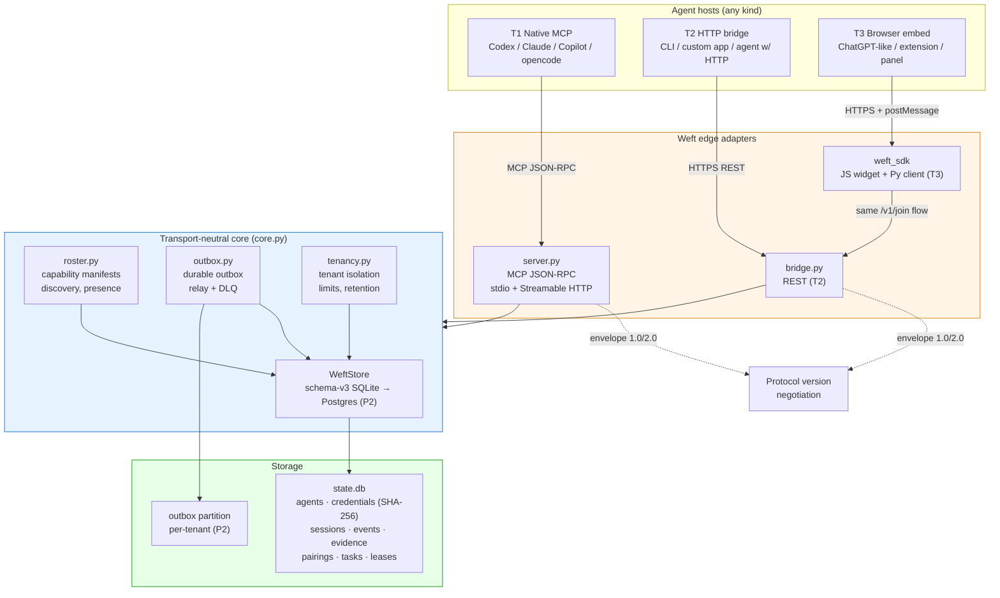

# NEXUS Architecture — Weft Universal Agent Interconnect

> **Owner:** ARCH-NEXUS lane (architecture, docs only — no source code).
> **Scope:** Blueprint for turning the single-node MCP coordinator into the universal
> agent interconnect. Every module name, tool name, and invariant here is a contract
> for other lanes to build against.
> **Status:** Buildable spec. No invented metrics. References actual repo artifacts.

---

## 0. Design roots (read this first)

Weft already ships a dependency-free, schema-v3 SQLite coordinator with:

- **One-version envelope:** `finalisma.a2a/1.0` (`PROTOCOL.md` §Message envelope).
- **Two-tier credential model:** per-agent `actor_token` (SHA-256 at rest) for the
  team/work plane; member-bound `session_token` for the ordered event log
  (`PROTOCOL.md` §Identity and credential boundary).
- **Atomic task claims** with leases + fencing tokens, duplicate detection, workspace
  scope locks, and evidence-gated completion.
- **Pairing links** that are one-use, preview-before-consent, and carry the secret in
  the URL fragment, never the path (`SECURITY_GATES.md`).
- **MCP edge** that is deliberately thin: `server.py` is an adapter over
  `core.py`'s transport-neutral store.

NEXUS preserves every one of those invariants. It adds **interconnect** on top.

---

## 1. The "link as universal connector" model

### 1.1 Core insight

A Weft link is already more than an MCP session — it is a **capability-bearing,
consent-gated invitation** with a public pairing ID and a secret fragment. The NEXUS
thesis: that link is the **single universal connector** between any two agent hosts,
whether or not either host speaks MCP.

One link binds any two hosts. The link format already supports this:

```
https://host.example/v1/join/pair_XXXXXXXX#token=fst_pair_YYYYYYYY
```

- Path `pair_XXXXXXXX` = public pairing ID (safe to log, reject if used as secret).
- Fragment `token=fst_pair_...` = one-time bearer capability (never in server logs
  or `Referer` headers — the browser/client must POST it in the body).

### 1.2 Bridging tiers

Not every host is an MCP client. NEXUS defines three **bridging tiers** so a link
works for all of them:

| Tier | Host kind | Transport | Adapter |
|------|-----------|-----------|---------|
| **T1 Native MCP** | Codex, Claude Code, Copilot, opencode, any MCP client | stdio or Streamable HTTP | Direct — no bridge needed |
| **T2 HTTP bridge** | CLI tools, custom apps, agents with HTTP but no MCP | HTTPS JSON | `bridge.py` exposes a minimal REST surface that maps to the same `core.py` calls the MCP dispatcher uses |
| **T3 Browser embed** | ChatGPT-like web UIs, browser extensions, embedded panels | HTTPS + postMessage | Lightweight JS widget that drives the same `/v1/join/...` flow the HTTP server already implements |

**Tier contract:** every tier consumes the same link, performs the same
`pairing_preview → consent → join` sequence, and ends with the same
`(agent_id, actor_token, session_token)` triple. No tier gets a shortcut past the
consent gate (`SECURITY_GATES.md` §consent=true mandatory).

### 1.3 How a T3 browser host joins today — without new server code

The existing HTTP server (`server.py` `_MCPRequestHandler`) already:

1. Serves `GET /v1/join/<pair_id>` → returns the pairing preview (public, no secret).
2. Accepts `POST /v1/join/<pair_id>` with the token in the JSON body.
3. Validates `Origin`, rate-limits, and enforces `consent=true`.

A browser embed is therefore **already implementable** against the shipped server:
a static page that calls `GET /v1/join/...`, renders the consent screen, and POSTs
the fragment token. NEXUS formalizes this as the **browser-embed SDK**
(`weft_sdk` — see §6).

### 1.4 The bridge contract (`bridge.py`)

`bridge.py` is the T2 adapter. It reuses `core.py` directly — it does NOT call the
MCP server over HTTP. It is a second edge adapter, parallel to `server.py`:

```
core.py ← server.py   (MCP JSON-RPC, stdio + HTTP)
core.py ← bridge.py   (REST for non-MCP hosts)
```

`bridge.py` exposes only the subset of operations a non-MCP host needs:

| Method | Path | Maps to |
|--------|------|---------|
| GET | `/v1/protocol` | `store.protocol_info()` |
| POST | `/v1/agents` | `store.register_agent(...)` |
| POST | `/v1/pairings` | `store.create_pairing(...)` |
| GET | `/v1/join/:id` | `store.pairing_preview(...)` |
| POST | `/v1/join/:id` | `store.join_pairing(...)` |
| POST | `/v1/sessions/:id/send` | `store.session_send(...)` |
| GET | `/v1/sessions/:id/poll` | `store.session_poll(...)` |
| POST | `/v1/tasks` | `store.create_task(...)` |
| GET | `/v1/tasks` | `store.team_status(...)` |

Auth: bearer <actor_token> for team-plane calls; the one-time pairing token for join.
`bridge.py` must apply the same `_assert_capability_scope` and team-boundary checks
`WeftDispatcher` applies.

---

## 2. N-agent topology

Today Weft coordinates **two** agents per session (`agent_a`, `agent_b` in the
`sessions` table). NEXUS generalizes to **N** while reusing every existing primitive.

### 2.1 Reuse map (do not re-implement)

| Existing primitive | Reused for |
|--------------------|------------|
| `agents` table + SHA-256 `agent_credentials` | Roster membership & auth |
| `sessions` table | Group session (N members instead of 2) |
| `session_events` with `seq` + `idempotency_key` | Total-ordered group log |
| `session_credentials` per `(session_id, agent_id)` | Per-member auth in the group |
| `pairings` table | The invite flow that seeds the group |
| `evidence` table | Per-task evidence, same as today |
| `tasks.fencing_token` + leases | Same scope/lease semantics |
| `messages` table (recipient_id + broadcast) | Direct + fan-out messaging |

### 2.2 Roster (`roster.py`)

The roster is the **set of active agents in a team**, derived from the existing
`agents` table plus a liveness signal. `roster.py` adds:

- **Capability manifest** — each agent declares a `capabilities_json` (already a
  column) plus a new `manifest_version` and `supported_envelope_versions` (e.g.
  `["finalisma.a2a/1.0"]`). Stored in the existing `metadata_json` column to avoid
  schema churn in P0; promoted to first-class columns in P1.
- **Presence** — derived from `last_seen` (already a column) vs.
  `heartbeat_timeout`. No new table; `roster.py` is a query + policy layer over
  `agents`.
- **Discovery** — `roster.discover(team_id, capability_filter)` returns agents whose
  `capabilities_json` contains all requested capabilities. This is what replaces
  the hardcoded `ROUTE_KEYWORDS` heuristic with a real capability match.

### 2.3 Group sessions

A group session reuses the `sessions` table by generalizing the `agent_a` /
`agent_b` columns into the existing `session_credentials` table, which already keys
by `(session_id, agent_id)`. P0 implementation:

- Keep `agent_a` / `agent_b` columns for backward compatibility (they hold the
  **founder** and **first joiner**).
- `session_credentials` holds **all** members (2..N).
- `session_events.origin_agent` already identifies the sender — no schema change.

Group semantics:

- **Fan-out:** `session_send` with no `recipient_id` → broadcast to all members
  (already supported via the `messages` table; for session events, every member
  reads from the shared `seq` log).
- **Direct:** `session_send` with `recipient_id` → routed (already supported).
- **Ordering:** total order via `seq` — unchanged. N-way ordering is identical to
  2-way because the log is append-only and idempotent.

### 2.4 Routing for N agents

`core.py._route()` already scores agents by capability keyword match + load. NEXUS
layers capability-aware routing on top:

1. Caller requests a task with required capabilities (e.g. `["security-review"]`).
2. `roster.discover(team_id, required_capabilities)` filters to qualified agents.
3. `_route()` picks the least-loaded qualified agent (existing load-join logic).

No new table. The existing `idx_tasks_open` index already supports the load query.

---

## 3. Multi-tenant hosted path

This section is the **roadmap from single-node to hosted**, gated by
`docs/SECURITY_GATES.md` (the "Must pass before multi-instance hosted traffic"
section is the entry condition for P2).

### 3.1 Single-node (P0, current)

- One `WeftStore`, one SQLite file, one process.
- `--team-id` scopes the coordinator to one team.
- Actor-auth `auto` (stdio trusted, HTTP requires actor credentials).
- Rate limit: in-process `_WindowRateLimiter` (single-node guard only).

### 3.2 Shared-storage (P1 → P2)

- **Shared transactional storage:** migrate from single-file SQLite to
  PostgreSQL (or SQLite-over-NFS with careful locking — not recommended). The data
  layer enforces `tenant_id` filtering on every query, not just HTTP handlers
  (`SECURITY_GATES.md` §shared transactional storage).
- **Tenant isolation:** `tenancy.py` wraps every query with a mandatory
  `tenant_id` filter. Cross-tenant reads/writes are rejected at the data layer.
- **Distributed rate limits:** replace `_WindowRateLimiter` with a shared store
  (Redis or Postgres advisory locks). `tenancy.py` owns the limiter; `bridge.py`
  and `server.py` call it.
- **Outbox (`outbox.py`):** durable event delivery. Every state mutation writes an
  outbox row in the same transaction. A relay process drains the outbox to
  webhooks/SSE subscribers. Dead-letter queue for failed deliveries. This is what
  makes push (not just poll) possible at scale.

### 3.3 OAuth/OIDC (P2)

- Replace the static HTTP bearer token with OAuth/OIDC resource-server validation
  (`SECURITY_GATES.md` §OAuth/OIDC).
- Audience binding + key rotation.
- `tenancy.py` validates the token, resolves the tenant, and binds the request.

### 3.4 Retention (P2)

- `scripts/weft-prune.py` already does dry-run-first retention cleanup.
- `tenancy.py` adds per-tenant retention policies (events older than N days,
  terminal sessions, stale pairings).
- Outbox retention: acked entries purged after a tenant-configurable window.

---

## 4. Protocol evolution: `finalisma.a2a/1.0` → `2.0`

### 4.1 Version 1.0 (shipped)

The current envelope (`PROTOCOL.md` §Message envelope):

```json
{
  "protocol": "finalisma.a2a",
  "version": "1.0",
  "message_id": "msg_...",
  "type": "task.progress",
  "sender": { "agent_id": "agent-a", "model": "gpt-5.6-luna" },
  "recipient": { "agent_id": "agent-b" },
  "payload": {},
  "capabilities": ["coding"],
  "trace_id": null,
  "signature": null
}
```

### 4.2 Version 2.0 (NEXUS)

Additions for N-agent interconnect:

```json
{
  "protocol": "finalisma.a2a",
  "version": "2.0",
  "message_id": "msg_...",
  "type": "task.progress",
  "sender": { "agent_id": "agent-a", "model": "gpt-5.6-luna" },
  "recipient": { "agent_id": "agent-b", "scope": "direct" },
  "roster": { "session_id": "ses_...", "members": 4 },
  "capability_manifest": {
    "version": 1,
    "offers": ["coding", "security-review"],
    "accepts": ["task.dispatch", "task.progress"]
  },
  "addressing": {
    "team_id": "demo",
    "tenant_id": "tenant_...",
    "intent": "handoff"
  },
  "payload": {},
  "trace_id": null,
  "signature": null
}
```

**New fields:**

| Field | Purpose |
|-------|---------|
| `recipient.scope` | `direct` \| `broadcast` — explicit fan-out semantics |
| `roster.session_id` + `members` | Group-session awareness |
| `capability_manifest` | Negotiated capabilities (see §5) |
| `addressing.tenant_id` | Multi-tenant routing (P2) |
| `addressing.intent` | `handoff` \| `broadcast` \| `delegation` \| `escalation` |

### 4.3 Backward compatibility

- A `1.0` consumer ignores unknown fields (standard JSON).
- A `2.0` consumer reading a `1.0` envelope treats `recipient.scope` as `direct`,
  `roster.members` as `2`, and `capability_manifest` as the legacy `capabilities`
  array.
- The `version` field drives adapter selection. `server.py` and `bridge.py` both
  negotiate: if the client sends `1.0`, respond with `1.0`. If the client sends
  `2.0` and the server supports it, respond `2.0`.
- No breaking changes to `core.py` storage: the envelope is stored as
  `payload_json` (already opaque JSON). Version negotiation happens at the edge.

---

## 5. Capability-preservation design

The vision promise: **"N-way, without capability loss."** Three mechanisms.

### 5.1 Envelope versioning (§4.3)

Every message carries its version. Adapters negotiate. Old clients keep working.
New clients degrade gracefully.

### 5.2 Capability manifests

Each agent declares a manifest at registration time (stored in `metadata_json`
in P0, first-class columns in P1):

```json
{
  "version": 1,
  "offers": ["coding", "security-review", "research"],
  "accepts": ["task.dispatch", "task.progress", "task.blocked"],
  "envelope_versions": ["finalisma.a2a/1.0", "finalisma.a2a/2.0"],
  "max_scope_paths": 256,
  "max_payload_bytes": 262144
}
```

`roster.discover()` matches on `offers`. `session_send` validates the recipient
`accepts` the message `type` before appending to the log.

### 5.3 Adapter degradation rules

When a T2/T3 host cannot express a capability the T1 MCP surface supports:

1. **Downgrade the envelope** to the highest mutually-supported version.
2. **Drop unsupported fields** — never fabricate them. A T3 browser that cannot
   produce a `capability_manifest` sends the legacy `capabilities` array; the
   receiver treats it as a flat offer list.
3. **Fail closed on evidence** — if a tier cannot submit the evidence gate
   (`verify_task`), the task stays in `review`. No tier gets to bypass
   the gate.
4. **Preserve the lease/fencing contract** — every tier must hold a valid fencing
   token to mutate a task. No adapter shortcut.

---

## 6. Phase plan

### P0 — Single-node universal connector (now)

**Goal:** Any host can join via a link, regardless of MCP support. Two-agent
coordination works for T1/T2/T3.

| Module | Lane | What it does |
|--------|------|-------------|
| *(shipped)* | — | `core.py`, `server.py`, `finalisma.a2a/1.0` envelope |
| `bridge.py` | bridge lane | REST adapter over `core.py` for T2 hosts |
| `weft_sdk` | SDK lane | Browser-embed JS + Python thin client for T3 |

**P0 deliverables:**
- `bridge.py` implements the REST surface in §1.4.
- `weft_sdk` ships a `<script>`-loadable widget that drives
  `GET /v1/join/:id` → consent → `POST /v1/join/:id` → `session_send`/`poll`.
- `roster.py` (P0 = read-only view): `discover(team_id, capabilities)` over the
  existing `agents` table.
- Docs: this file. ADR: `0001-link-as-universal-connector.md`.

**P0 non-goals:** N-way sessions (still 2-agent), multi-tenancy, outbox, push.

### P1 — N-agent + durable delivery

**Goal:** Groups of 3+, fan-out, capability negotiation, durable push.

| Module | Lane | What it does |
|--------|------|-------------|
| `roster.py` | roster lane | Full capability manifests, discovery, presence |
| `outbox.py` | outbox lane | Transactional outbox + relay + dead-letter queue |
| `bridge.py` | bridge lane | Add `roster`, group-session, and `2.0` endpoints |
| `server.py` | MCP lane | Negotiate `1.0`/`2.0`; group-session tools |

**P1 deliverables:**
- Group sessions (N members) via `session_credentials` generalization.
- `finalisma.a2a/2.0` envelope with roster, capability manifest, addressing.
- Outbox relay delivers events to webhooks (push, not just poll).
- `roster.discover()` replaces `ROUTE_KEYWORDS` as the primary routing input.

### P2 — Hosted multi-tenant

**Goal:** YC/incubator-grade hosted service. OAuth/OIDC, tenant isolation, distributed
limits, retention.

| Module | Lane | What it does |
|--------|------|-------------|
| `tenancy.py` | tenancy lane | Tenant resolution, per-tenant query filters, distributed limits, retention |
| `outbox.py` | outbox lane | Per-tenant outbox partitions, DLQ, tenant-scoped relay |
| `bridge.py` | bridge lane | OAuth/OIDC resource-server validation |
| `server.py` | MCP lane | OAuth/OIDC for remote MCP |

**P2 deliverables:**
- PostgreSQL (or equivalent) with `tenant_id` filtering at the data layer.
- OAuth/OIDC with audience binding + key rotation.
- Distributed rate limiter (shared store).
- Per-tenant retention policies.
- Operational dashboard + alerting (referenced from `SECURITY_GATES.md`).

### Lane map (module → owner contract)

```
roster.py     → roster lane     (capability manifests, discovery, presence)
outbox.py     → outbox lane     (durable delivery, relay, DLQ)
tenancy.py    → tenancy lane    (tenant isolation, limits, retention)
bridge.py     → bridge lane     (REST adapter for non-MCP hosts)
weft_sdk → SDK lane        (browser widget + thin Python client)
```

**Naming contract — do not rename.** Other lanes build against these exact names.

---

## 7. Architecture diagram



---

## 8. Invariants carried forward

These are **non-negotiable** — they already ship in `core.py` / `server.py`:

1. Pair tokens are one-use, hashed at rest, expire, secret in fragment only.
2. `consent=true` is mandatory and type-strict (JSON boolean).
3. Actor tokens: issued once, SHA-256 at rest, never overwritten by re-pairing.
4. Session tokens are member-bound, separate from actor credentials.
5. Task claims are atomic; fencing tokens required for every mutation.
6. Completion requires a passed evidence gate.
7. The server never executes payloads.
8. Cross-team access is rejected at the data layer (P2: at the tenant layer).

---

## 9. What other lanes must know

- **Module names are fixed:** `roster.py`, `outbox.py`, `tenancy.py`, `bridge.py`,
  `weft_sdk`. Do not rename — the lane map in §6 is the build contract.
- **`bridge.py` reuses `core.py`, not `server.py`.** It is a parallel edge adapter.
- **No schema changes in P0.** Capability manifests live in `metadata_json`.
- **The `/v1/join/:id` flow is the universal onboarding.** Every tier — T1/T2/T3 —
  uses the same link, the same preview, the same consent POST.
- **`finalisma.a2a/2.0` is additive.** Unknown fields ignored by `1.0` consumers;
  `2.0` consumers fall back to `1.0` defaults for missing fields.
- **`SECURITY_GATES.md` is the gate for P2.** Do not claim multi-tenant hosted
  until its "Must pass before multi-instance hosted traffic" section is green.
- **Evidence gate is tier-invariant.** No adapter may bypass `verify_task`.
