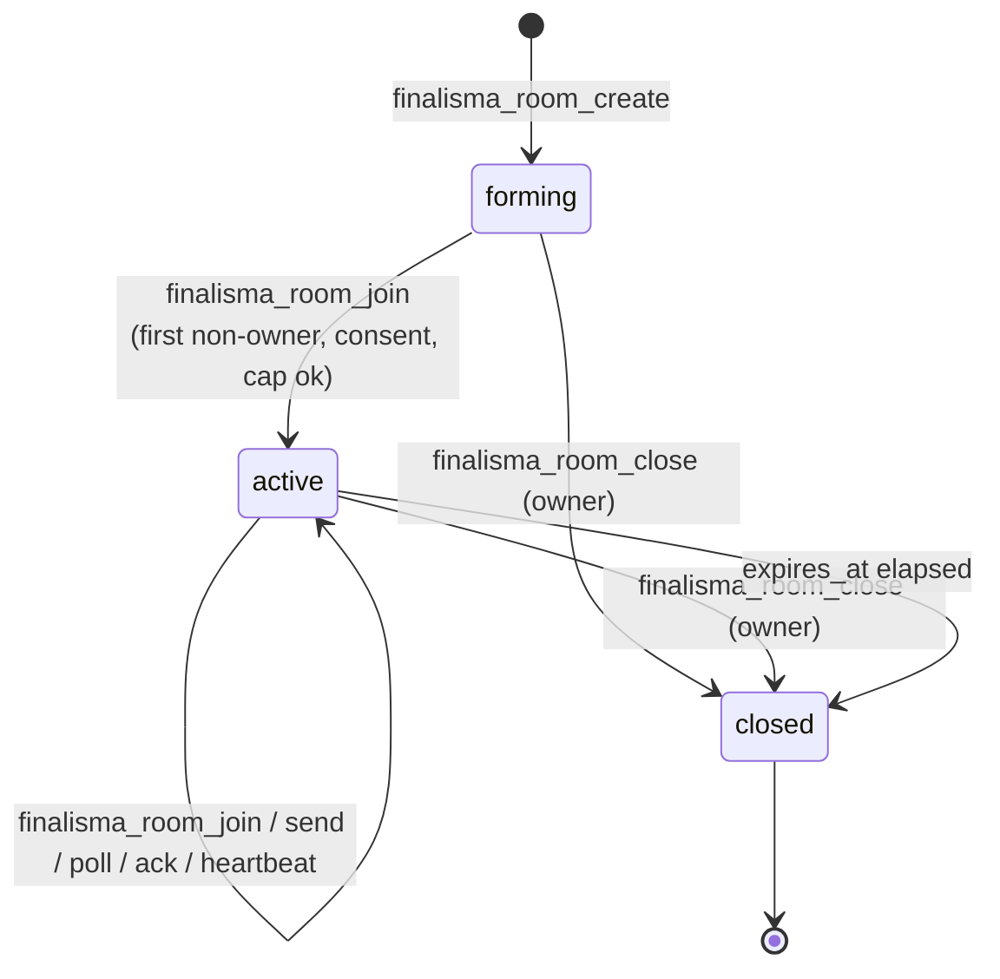
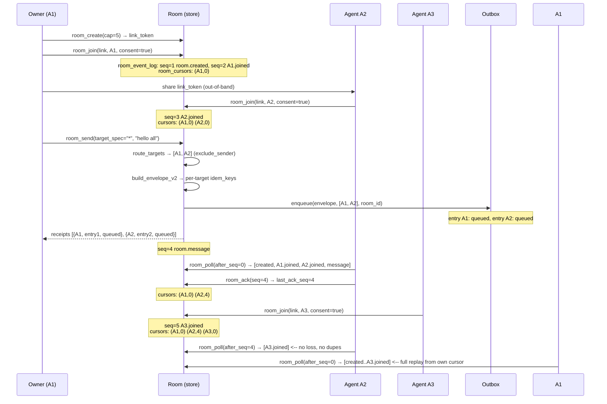

# Rooms — authoritative design (Wave E)

> **Status:** design-locked. Implementation lanes build from this document.
> **Scope:** the Room product object, built by composition over existing primitives
> in `src/finalisma_mcp/roster.py`, `outbox.py`, and `core.py`. Coordinator plane
> only — stdlib, SQLite, zero new runtime dependencies.
> **Author:** ARCH-ROOMS (Wave E lead architect). Doc-only lane; this file touches
> nothing else.

---

## 1. Product shape

A **Room** is the product object. One multi-use link admits **N** agents, each with
its own identity (`agent_id`) and a capability manifest, bounded by a room **cap**.
Members see the roster, presence, and an ordered event log replayed from their own
per-member cursor. Any member can address one agent, a named group, or the whole
room, with durable per-recipient delivery receipts. Joining is still
**preview-before-consent**; every member is attributable to an `agent_id` plus an
actor credential. Tasks created inside a room still run through `create_task` /
`claim_task` / `verify_task` / `complete_task` with their leases, fencing tokens,
and evidence gates intact. A room survives disconnects: members resume from their
cursor with **no loss and no duplicates**. The room is **additive** — the existing
one-use two-party pairing path (`finalisma_create_pairing` / `finalisma_join_pairing`)
keeps working unchanged.

---

## 2. State machine

### 2.1 Room-level states

| State | Meaning | Allowed transitions |
| --- | --- | --- |
| `forming` | Created, no members beyond owner; accepting joins. | → `active` (on first join past owner, or directly on close) |
| `active` | Members present; accepting joins (until cap), sends, polls, tasks. | → `closed` (owner close, or expiry) |
| `closed` | No joins, no new events. In-flight work may finish. | terminal |

**Transitions and the tools that trigger them:**

| From | To | Trigger | Guard |
| --- | --- | --- | --- |
| *(none)* | `forming` | `finalisma_room_create` | — |
| `forming` | `active` | `finalisma_room_join` (first non-owner join) | link valid, cap not reached, consent=true |
| `forming` | `closed` | `finalisma_room_close` | caller is owner |
| `active` | `closed` | `finalisma_room_close` | caller is `owner_agent_id` |
| `active` | `closed` | expiry tick (`expires_at < now`) | TTL elapsed |
| `active` | `active` | `finalisma_room_join` | link valid, cap not reached, consent=true |

A `closed` room **refuses joins** (`room_closed`) and **refuses new sends**
(`room_closed`). Existing members with in-flight tasks may continue to
`claim_task` / `verify_task` / `complete_task` against tasks that already carry the
`room_id` — closing a room does **not** cancel open tasks. Members who are only
consumers (no in-flight lease) are effectively evicted: their next `poll` returns
`room_closed` and an empty event list, and re-join is refused. This is the
**finish-in-flight, evict-consumers** decision.

### 2.2 Per-member states (reused from `roster.py`)

`active` / `stale` / `left`. Derived from `roster_members.last_seen` and
`STALE_AFTER_SECONDS = 1800` (roster.py:30). A member that disconnects keeps its
row and cursor; on reconnect it heartbeats (→ `active`) and polls from
`last_ack_seq`. No row is deleted on disconnect — only an explicit `leave` or
`close` removes it.

---

## 3. Multi-use link — the security-model delta

### 3.1 What changes

`roster.create_link` / `consume_link` (roster.py:360-407) are **one-use**: the first
`consume_link` sets `consumed_at` and every later consume returns `False`. A leaked
one-use link grants an attacker **one** join, and only until the legitimate invitee
consumes it first or it expires.

A room link is **multi-use up to the cap**. A leaked multi-use link grants
**anyone holding it** the ability to join the room as a new, attributable member
until the cap is reached, the link expires, or it is revoked. That is the honest
delta: the blast radius is bounded by the cap, not by one-shot consumption.

### 3.2 Compensating controls

1. **Per-join consent.** The link alone does **not** grant read access. A join
   call carries `consent: true` (literal JSON boolean, rejected otherwise) and the
   joining agent must supply its own `agent_id` plus a fresh `actor_token` that is
   bound to that identity on first join (mirror `core.join_pairing` and
   `SECURITY_GATES.md` §1: a pair token cannot overwrite an existing identity).
   The room wrapper previews the room summary **before** consent, exactly as
   `finalisma_pairing_preview` does for pairing.
2. **Cap bounds blast radius.** The cap is the hard upper bound on distinct
   members. Even with a fully leaked link, an attacker can create at most `cap`
   attributable identities.
3. **Expiry.** Every room link has `expires_at`. The expiry is checked on every
   join; an expired link is refused with `link_expired`.
4. **Revocation.** `finalisma_room_close` and an explicit
   `finalisma_room_revoke_link` flip a `revoked` flag on the link row. A
   revoked/expired link cannot admit anyone (`link_revoked`).
5. **Attributable membership.** Every join is bound to `agent_id` + actor
   credential. A leaked link yields **attributable** members, never anonymous
   readers. The roster records who joined and when.
6. **Token hygiene.** Mirror roster.py: only `SHA-256(link_token)` is stored
   (`roster_links.token_hash`, unique). The raw token is returned **once** on
   `room_create` and never again. Token-bearing URL paths are rejected at the
   HTTP layer (existing gate).

### 3.3 Cap enforcement (atomic)

Joining past the cap is refused with `room_full`. The cap check and the member
insert MUST run inside a single `BEGIN IMMEDIATE` transaction
(`roster._transaction`, roster.py:136) so N concurrent joins cannot overshoot:

```
SELECT COUNT(*) FROM room_members WHERE room_id = ? AND status = 'active'
→ if count >= cap: raise FinalismaError("room_full", ...)
→ else: INSERT the new member
```

Because `BEGIN IMMEDIATE` takes a SQLite writer lock for the duration, the
read-then-insert is atomic and concurrent joins serialize. The unique constraint
on `(room_id, agent_id)` is the second line of defense.

### 3.4 Link replay vs impersonation

Membership is keyed by **`(room_id, agent_id)`** (`room_members` PK). A link can
be used **once per distinct new agent identity**. It cannot be replayed to claim
an **existing** member's identity:

- **New `agent_id` + valid link + consent** → new member row (under cap).
- **Existing `agent_id` + valid link** → the join is treated as a **re-join**,
  not an overwrite. If the row already exists and is `active`, the join returns
  the existing membership unchanged (idempotent re-join, mirroring
  `roster.join_roster` ON CONFLICT behavior, roster.py:182). If the row is
  `left`, re-join reactivates it (subject to cap against *active* count). The
  link is **not** consumed either way — it remains usable for other identities.
- **Existing `agent_id` + valid link + different `actor_token`** → refused:
  the actor credential must match the stored credential for that `agent_id`
  (`actor_auth_invalid`). A link can never overwrite an identity.

### 3.5 New table (not a rewrite)

The multi-use link lives in a **new** `room_links` table — it does **not** modify
`roster_links` (which stays one-use for the two-party pairing path). See §10.

---

## 4. Presence

Presence is derived directly from `roster.heartbeat` and
`STALE_AFTER_SECONDS = 1800` (roster.py:30, 236-242). A member calls
`finalisma_room_heartbeat` (or any room activity touches `last_seen`).

A member calling `finalisma_room_info` sees, for **its own room only**:

```json
{
  "agent_id": "...",
  "status": "active" | "stale",
  "capabilities": ["..."],
  "last_seen": 1722800000.0,
  "joined_at": "2026-08-05T..."
}
```

Churn (join / leave / close) is reflected as room events in the ordered log
(§5) **and** as roster membership changes. A member **cannot** see another room's
roster: every tool call is scoped by `room_id`, and a non-member gets
`member_required`. Team-level isolation is enforced by `_apply_team_scope`
(server.py:713) on top of that.

---

## 5. Ordered event log + per-member cursor

### 5.1 New table: `room_event_log`

The existing `session_events` / `session_cursors` tables (core.py:513-527) are
bound to a two-party `session_id` and authenticated by a session token. A room
has N members, is authenticated by `actor_token`, and outlives any single
process — so the room gets its **own** event-log table rather than reusing the
session tables:

```sql
CREATE TABLE IF NOT EXISTS room_event_log (
    event_id TEXT PRIMARY KEY,
    room_id TEXT NOT NULL,
    seq INTEGER NOT NULL,
    origin_agent TEXT NOT NULL,
    kind TEXT NOT NULL,
    payload_json TEXT NOT NULL,
    idempotency_key TEXT NOT NULL,
    trace_id TEXT,
    created_at TEXT NOT NULL,
    UNIQUE(room_id, seq),
    UNIQUE(room_id, origin_agent, idempotency_key)
);
CREATE INDEX IF NOT EXISTS idx_room_events_replay
    ON room_event_log(room_id, seq);

CREATE TABLE IF NOT EXISTS room_cursors (
    room_id TEXT NOT NULL,
    agent_id TEXT NOT NULL,
    last_ack_seq INTEGER NOT NULL,
    updated_at TEXT NOT NULL,
    PRIMARY KEY (room_id, agent_id)
);
```

The shape mirrors `session_events` / `session_cursors` (core.py:505-527) exactly
so the same cursor logic applies.

### 5.2 Per-member cursor — the exact SQL uniqueness

The cursor is per-member because `room_cursors` has **`PRIMARY KEY (room_id,
agent_id)`**. The ack upsert is:

```sql
INSERT INTO room_cursors(room_id, agent_id, last_ack_seq, updated_at)
VALUES (?, ?, ?, ?)
ON CONFLICT(room_id, agent_id) DO UPDATE
  SET last_ack_seq = MAX(last_ack_seq, excluded.last_ack_seq),
      updated_at = excluded.updated_at
```

This is the same monotonic-ack pattern as `core.session_ack` (core.py:1829).
`MAX` makes ack monotonic — acking seq 5 then seq 3 leaves the cursor at 5.

### 5.3 Replay invariant

- **At-least-once delivery.** `room_poll` returns all events with `seq > after_seq`
  (default `after_seq = last_ack_seq`). Events are never removed by poll. A
  consumer that crashes after processing but before acking re-receives the same
  events on the next poll — consumers must be idempotent (the per-sender
  `idempotency_key` UNIQUE constraint deduplicates replays).
- **No loss.** Events are append-only; `seq` is a room-wide monotonic assigned
  under `BEGIN IMMEDIATE` (read `cursor_head`, +1, insert). Reconnect resumes
  from `last_ack_seq` — every event with higher seq is still in the table.
- **No duplicates.** `UNIQUE(room_id, seq)` guarantees one event per seq; the
  consumer's `after_seq` filter skips already-acked events; the idempotency-key
  UNIQUE suppresses duplicate sends from the same origin.

### 5.4 Event kinds

`room.created`, `room.joined`, `room.left`, `room.closed`, `room.message`,
`room.task.created`, `room.task.claimed`, `room.task.verified`,
`room.task.completed`, `room.group.updated`. Every state change in §2 is an
append-only event.

---

## 6. Addressing — unicast / group / broadcast with receipts

Compose three existing primitives:

1. **`roster.route_targets(roster_id, target_spec)`** (roster.py:304-354)
   expands `target_spec` — an `agent_id`, a group name, `"*"` (broadcast to
   active members), or a mixed list — into a de-duplicated, stale-excluded
   recipient list. Stale members are excluded. The sender is **not**
   auto-excluded; the room wrapper decides (see below).
2. **`roster.build_envelope_v2(sender, targets, type, payload, capabilities)`**
   (roster.py:413-454) assembles the v2 envelope with a per-target
   `idempotency_key` so the same logical message fans out without cross-recipient
   collisions.
3. **`outbox.enqueue(envelope, recipients, roster_or_team_id=room_id)`**
   (outbox.py:180-221) creates one durable `outbox_entries` row per recipient
   with status `queued`. The per-recipient idempotency key is
   `(envelope_id, roster_or_team_id, recipient)` — re-enqueueing the same triple
   returns the existing entry ids.

### 6.1 Delivery-receipt shape

Each recipient's `outbox_entries` row carries a `status`:

| status | meaning |
| --- | --- |
| `queued` | waiting for its `next_attempt_at` |
| `in_flight` | claimed by a deliverer |
| `delivered` | acked by the recipient host |
| `dead` | exceeded `max_attempts`; moved to `outbox_dlq` |

`finalisma_room_send` returns, for each target, the `entry_id` and its initial
status. A sender queries receipt status with `finalisma_room_receipts`
(`entry_id` → `{status, attempts, next_attempt_at, last_error}`). Delivery is
driven by the existing `claim_due` / `mark_delivered` / `mark_retry` loop
(outbox.py:224-330); the room does not add a delivery loop.

### 6.2 Sender exclusion

`route_targets` does **not** auto-exclude the sender (roster.py:313). For a
true broadcast the room wrapper subtracts `sender_agent_id` from the recipient
list **before** calling `envelope`+`enqueue` when the caller sets
`exclude_sender: true` (default for `"*"`, opt-in for lists). Unicast and group
targets are passed through unchanged.

---

## 7. Governance reuse

Tasks inside a room use the **existing** task methods unchanged:

- `core.create_task(team_id, created_by, ..., metadata=...)` — the room binds a
  task to itself by passing **`{"room_id": room_id, ...}` in the `metadata`
  argument** (or, if the implementation lane prefers, a `room_id` column is
  added to `tasks` as a nullable, indexed column — see §10). No existing column
  or invariant is altered either way.
- `core.claim_task`, `core.verify_task`, `core.complete_task` — leases, fencing
  tokens (`fencing_token`), evidence gates, scope-lock conflicts, and
  `stale_fencing_token` refusals all apply unchanged. A task bound to a room is
  still owned by one lease-holder at a time; a stale fencing token still cannot
  complete it.

**The room does not weaken any existing invariant.** The existing one-use two-party
pairing path (`finalisma_create_pairing` / `finalisma_join_pairing`) keeps working
unchanged — the room is **additive**. Existing pairing tests must stay green.

---

## 8. New MCP tool surface

All tools are member-only and require `actor_token` (mutations and reads alike —
a room is not publicly readable). They are dispatched by `FinalismaDispatcher`
(server.py:746) and scoped by `_apply_team_scope` (server.py:713).

| # | Tool | Required args | Returns | Notes |
| --- | --- | --- | --- | --- |
| 1 | `finalisma_room_create` | `team_id, owner_agent_id, cap` | `{room_id, link_token, shareable_link, expires_at, cap, state}` | `name?`, `ttl_seconds?` (default 86400). Owner joins automatically. `cap` ≥ 2. `shareable_link` is an absolute `{origin}/j/{link_token}` URL an agent can fetch to discover the join endpoint and protocol. |
| 2 | `finalisma_room_join` | `team_id, room_id, link_token, agent_id, consent, actor_token` | `{room_id, agent_id, status, joined_at, cursor}` | `capabilities?`. `consent` must be literal boolean `true`. Link is consumed for THIS identity only. |
| 3 | `finalisma_room_info` | `team_id, room_id, agent_id, actor_token` | `{room_id, state, cap, member_count, members:[{agent_id, status, capabilities, last_seen, joined_at}], owner_agent_id}` | Member-only. |
| 4 | `finalisma_room_leave` | `team_id, room_id, agent_id, actor_token` | `{room_id, agent_id, status: "left"}` | Emits `room.left`. |
| 5 | `finalisma_room_close` | `team_id, room_id, owner_agent_id, actor_token` | `{room_id, state: "closed"}` | Owner only. Invalidates all links. Emits `room.closed`. |
| 6 | `finalisma_room_send` | `team_id, room_id, sender_agent_id, target_spec, payload, actor_token` | `{envelope, receipts:[{agent_id, entry_id, status}], seq}` | `exclude_sender?`. Emits `room.message`. |
| 7 | `finalisma_room_poll` | `team_id, room_id, agent_id, actor_token` | `{events, next_seq, cursor_head, last_ack_seq, has_more, state}` | `after_seq?` (default `last_ack_seq`), `limit?` (default 100, max 200). |
| 8 | `finalisma_room_ack` | `team_id, room_id, agent_id, seq, actor_token` | `{room_id, agent_id, last_ack_seq}` | Monotonic. |
| 9 | `finalisma_room_heartbeat` | `team_id, room_id, agent_id, actor_token` | `{room_id, agent_id, last_seen, status}` | Refreshes presence. |
| 10 | `finalisma_room_groups` | `team_id, room_id, agent_id, group_name, action, actor_token` | `{room_id, group_name, members}` | `action` ∈ `add`, `remove`, `list`. Wraps `roster.add_to_group` / `remove_from_group` / `list_group`. |
| 11 | `finalisma_room_receipts` | `team_id, room_id, agent_id, entry_ids, actor_token` | `{receipts:[{entry_id, status, attempts, next_attempt_at, last_error}]}` | Member-only. |
| 12 | `finalisma_room_revoke_link` | `team_id, room_id, owner_agent_id, link_id, actor_token` | `{link_id, revoked: true}` | Owner only. Flips `revoked`. |

### 8.1 Error codes

`room_not_found`, `room_closed`, `room_full`, `invalid_link`, `link_expired`,
`link_revoked`, `member_required`, `consent_required`, `cross_room_forbidden`,
`stale_fencing_token` (reused from core), `actor_auth_invalid`, `invalid_argument`,
`team_scope_forbidden` (from `_apply_team_scope`).

### 8.2 Which tools need `actor_token`

**All of them.** Every room read and mutation is member-only. A call without a
valid `actor_token` bound to a member `agent_id` gets `actor_auth_invalid` or
`member_required`.

---

## 9. Negative-case spec

These are the product. Each is a required security-integration test.

| # | Call | Expected error | Invariant protected |
| --- | --- | --- | --- |
| 1 | `room_join` when active member count == cap | `room_full` | Cap is hard; no overshoot. |
| 2 | `room_join` with a revoked link | `link_revoked` | Revocation is effective. |
| 3 | `room_join` with an expired link | `link_expired` | TTL is enforced. |
| 4 | `room_join` with a link for a different room | `invalid_link` | Link is room-scoped. |
| 5 | `room_poll` / `room_info` by a non-member | `member_required` | Room is member-only. |
| 6 | `room_poll` on room B by a room A member (spoofed `room_id`) | `room_not_found` or `member_required` | Cross-room isolation. |
| 7 | `room_send` by a non-member | `member_required` | Only members address the room. |
| 8 | `complete_task` with a stale `fencing_token` on a room task | `stale_fencing_token` | Governance unchanged. |
| 9 | `room_join` reusing an existing `agent_id` with a **different** `actor_token` | `actor_auth_invalid` | Link cannot overwrite an identity. |
| 10 | `room_join` with `consent: "yes"` (string) | `consent_required` | Consent must be literal boolean. |
| 11 | `room_close` by a non-owner | `member_required` (or a new `owner_required`) | Only the owner closes. |
| 12 | `room_join` after `room_close` | `room_closed` | Closed rooms refuse joins. |
| 13 | `room_send` after `room_closed` | `room_closed` | Closed rooms refuse new events. |
| 14 | `room_join` reusing an existing `agent_id` with the **same** credential | idempotent re-join (no overwrite) | Replay does not overwrite identity. |
| 15 | Concurrent `room_join` × (cap + 5) | exactly `cap - owner` succeed, rest `room_full` | Atomic cap enforcement. |

---

## 10. Migration / backcompat

Rooms are **additive**. No existing table, tool, or test changes. Existing
two-party tests stay green. New tables are `room_`-prefixed in the same SQLite
file, created idempotently with `CREATE TABLE IF NOT EXISTS`:

```sql
CREATE TABLE IF NOT EXISTS room_rooms (
    room_id TEXT PRIMARY KEY,
    team_id TEXT NOT NULL,
    owner_agent_id TEXT NOT NULL,
    name TEXT,
    cap INTEGER NOT NULL,
    state TEXT NOT NULL DEFAULT 'forming',
    link_id TEXT NOT NULL,
    created_at TEXT NOT NULL,
    expires_at REAL NOT NULL,
    cursor_head INTEGER NOT NULL DEFAULT 0,
    CHECK(state IN ('forming','active','closed'))
);

CREATE TABLE IF NOT EXISTS room_members (
    room_id TEXT NOT NULL,
    agent_id TEXT NOT NULL,
    joined_at TEXT NOT NULL,
    last_seen REAL NOT NULL,
    status TEXT NOT NULL DEFAULT 'active',
    capabilities_json TEXT NOT NULL DEFAULT '[]',
    actor_token_hash TEXT NOT NULL,
    PRIMARY KEY (room_id, agent_id)
);

CREATE TABLE IF NOT EXISTS room_links (
    link_id TEXT PRIMARY KEY,
    room_id TEXT NOT NULL,
    token_hash TEXT NOT NULL UNIQUE,
    created_by TEXT NOT NULL,
    created_at TEXT NOT NULL,
    expires_at REAL NOT NULL,
    revoked INTEGER NOT NULL DEFAULT 0,
    max_uses INTEGER NOT NULL,            -- equals room cap
    use_count INTEGER NOT NULL DEFAULT 0  -- active-member count; kept in sync with room_members
);
CREATE INDEX IF NOT EXISTS idx_room_links_room ON room_links(room_id);

-- room_event_log and room_cursors as defined in §5.2.

CREATE TABLE IF NOT EXISTS room_groups (
    room_id TEXT NOT NULL,
    group_name TEXT NOT NULL,
    PRIMARY KEY (room_id, group_name)
);
CREATE TABLE IF NOT EXISTS room_group_members (
    room_id TEXT NOT NULL,
    group_name TEXT NOT NULL,
    agent_id TEXT NOT NULL,
    PRIMARY KEY (room_id, group_name, agent_id)
);
```

**Optional `tasks.room_id` column.** If the implementation lane prefers a formal
foreign key over `metadata`, add a nullable `room_id TEXT` column to `tasks`
with an index, **without** removing or altering any existing column. Either
approach is backward-compatible; the `metadata` approach requires zero schema
change to `tasks`.

---

## 11. Diagrams

### 11.1 Room lifecycle state machine



### 11.2 Three-agent room with cursors and outbox receipts



---

## Report

```
FILES CHANGED: docs/ROOMS_DESIGN.md
SECURITY-MODEL DELTA: A room link is multi-use up to the cap, so a leaked link grants anyone holding it the ability to join as a new attributable member until the cap is reached, the link expires, or it is revoked — unlike the one-use roster link where a leak grants at most one join. Compensating controls: (1) per-join consent with preview-before-consent and a fresh actor credential bound to the joining agent_id, so the link alone never grants read access; (2) the cap bounds blast radius; (3) expiry checked on every join; (4) explicit revocation and room-close invalidation; (5) every member is attributable (agent_id + actor_token_hash); (6) token hygiene mirrors roster.py — only SHA-256(token) stored, raw token returned once, token-bearing URL paths rejected.
NEW PRIMITIVES REQUIRED: none — pure composition over roster.py (create_roster/join_roster/leave_roster/heartbeat/route_targets/build_envelope_v2/groups), outbox.py (enqueue/claim_due/mark_delivered/mark_retry), and core.py (create_task/claim_task/verify_task/complete_task with leases/fencing/evidence). New tables only: room_rooms, room_members, room_links, room_event_log, room_cursors, room_groups, room_group_members (all room_-prefixed, additive, no existing table modified).
TOOL SURFACE COUNT: 12 finalisma_room_* tools (create, join, info, leave, close, send, poll, ack, heartbeat, groups, receipts, revoke_link).
NEGATIVE CASES SPECIFIED: 15 (see §9 table).
NOT DONE: implementation (this is the doc-only lane); the optional tasks.room_id column decision is deferred to the implementation lane (metadata={room_id} works with zero schema change).
RISKS: (1) the cap-enforcement read-then-insert MUST run under BEGIN IMMEDIATE to prevent N concurrent joins overshooting — verify the implementation does not use a plain read-then-write without the writer lock; (2) room_event_log must be a NEW table, not a reuse of session_events — the orchestrator must confirm the implementation lane does not rewrite core's session tables; (3) the link token must be returned exactly once and only its SHA-256 stored — any design that persists the raw token or returns it on info/poll is a regression; (4) actor_token is required on ALL room tools — a lane that makes info or poll anonymous breaks member-only isolation; (5) the existing two-party pairing tests must stay green — the room is additive, never a replacement.
```
